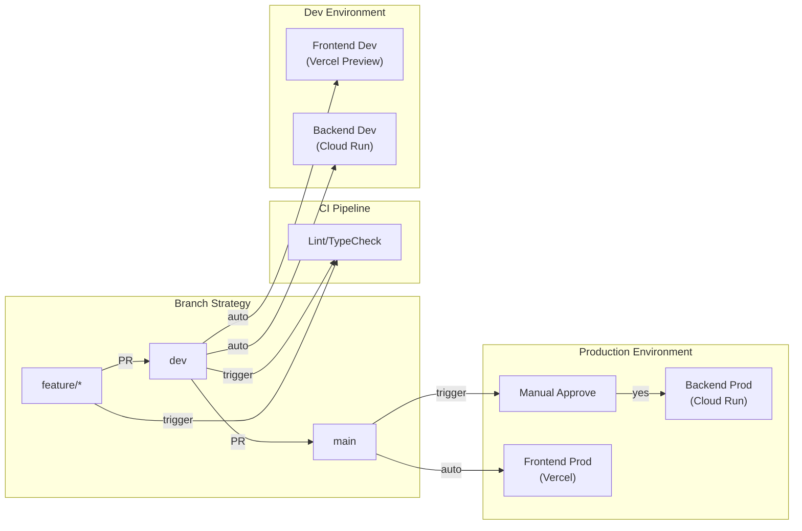

# CI/CD Pipeline 구축 계획 (v3 - 환경변수 관리 포함)

## 아키텍처 개요




## 환경 구성

| 환경 | Backend | Frontend | 용도 ||------|---------|----------|------|| **Production** | `read-for-me-backend` | Vercel main | 실서비스 || **Development** | `read-for-me-backend-dev` | Vercel dev branch | 개발/테스트 |

### Cloud Run 설정 비교

| 설정 | Production | Development ||------|------------|-------------|| `min-instances` | 0 (또는 1) | 0 || `max-instances` | 10 | 3 || Memory | 1Gi | 1Gi || GCS Bucket | `read-for-me-data` | `read-for-me-data-dev` |

## 브랜치 전략 (Git Flow)

| 브랜치 | 배포 환경 | 배포 방식 ||--------|-----------|-----------|| `main` | Production | 수동 승인 후 배포 || `dev` | Development | 자동 배포 || `feature/*` | - | 로컬 개발만 |**PR 워크플로우**: `feature/*` → `dev` (자동 배포) → `main` (승인 후 배포)---

## 🔐 환경변수 관리 전략

### 핵심 원칙

1. **민감한 정보**는 절대 GitHub에 올리지 않음
2. **GCP Secret Manager**로 API 키 관리
3. **Cloud Run 자동 인증**으로 서비스 계정 키 불필요

### Cloud Run 자동 인증 메커니즘

```javascript
┌─────────────────────────────────────────────────────────────┐
│                     Cloud Run 컨테이너                       │
│                                                             │
│  애플리케이션 코드                                           │
│      │ Google Cloud 라이브러리 호출                          │
│      ▼ (google-cloud-storage, langchain-google-genai 등)    │
│  ┌─────────────────────────────────────────────────────┐   │
│  │ ADC (Application Default Credentials)               │   │
│  │ → GCP 메타데이터 서버에서 자동으로 토큰 획득           │   │
│  └─────────────────────────────────────────────────────┘   │
│                          │                                  │
└──────────────────────────│──────────────────────────────────┘
                           ▼
              ┌─────────────────────────┐
              │ Cloud Run 서비스 계정    │
              │ (자동으로 할당됨)        │
              └─────────────────────────┘
```

> **중요**: 로컬 개발에서는 서비스 계정 키 파일이 필요하지만, Cloud Run에서는 자동 인증되므로 키 파일을 배포에 포함시키지 않습니다.

### 환경변수 분류

| 환경변수 | 분류 | 저장 위치 | Dev/Prod 차이 ||---------|------|----------|--------------|| **민감한 정보** || `OPENAI_API_KEY` | 🔴 Secret | GCP Secret Manager | 동일 || **환경별로 다른 값** || `BACKEND_CORS_ORIGINS` | 🟡 Config | `.github/env/*.env` | Dev/Prod URL 다름 || `GCS_BUCKET_NAME` | 🟡 Config | `.github/env/*.env` | `*-dev` / `*` || `PHOENIX_ENABLED` | 🟡 Config | `.github/env/*.env` | `false` / `false` || **고정 값** || `PROJECT_NAME`, `VERSION` 등 | 🟢 Static | `.github/env/*.env` | 동일 |

### 환경변수 설정 파일

**`.github/env/dev.env`** - Development 환경:

```bash
PROJECT_NAME=Read-For-Me
VERSION=0.1.0
API_V1_STR=/api/v1
STORAGE_BACKEND=gcs
GCS_BUCKET_NAME=read-for-me-data-dev
GCS_PROJECT_ID=gen-lang-client-0039052673
BACKEND_CORS_ORIGINS=https://*.vercel.app,http://localhost:3000
PHOENIX_ENABLED=false
# ... (전체 설정은 파일 참조)
```

**`.github/env/prod.env`** - Production 환경:

```bash
PROJECT_NAME=Read-For-Me
VERSION=0.1.0
API_V1_STR=/api/v1
STORAGE_BACKEND=gcs
GCS_BUCKET_NAME=read-for-me-data
GCS_PROJECT_ID=gen-lang-client-0039052673
BACKEND_CORS_ORIGINS=https://read-for-me.vercel.app
PHOENIX_ENABLED=false
# ... (전체 설정은 파일 참조)
```

---

## 구현 항목

### 0. 사전 준비

#### GitHub Repository 연결

```bash
# 프로젝트 폴더에서
git init
git add .
git commit -m "Initial commit"
git branch -M main
git remote add origin https://github.com/YOUR_USERNAME/parallel_audio_pipeline.git
git push -u origin main

# dev 브랜치 생성
git checkout -b dev
git push -u origin dev
```


#### .gitignore 필수 항목

```gitignore
# 환경 변수 및 시크릿
.env
.env.local
*-key.json
service-account*.json

# Python
__pycache__/
.venv/
.mypy_cache/

# Node.js
node_modules/
.next/

# 로컬 데이터
backend/data/
```


### 1. CI 워크플로우 (`.github/workflows/ci.yml`)

PR 생성/업데이트 시 자동 실행:**Backend 검증:**

- `ruff check` - 린트
- `ruff format --check` - 포맷 검사
- `mypy` - 타입 체크

**Frontend 검증:**

- `pnpm lint` - ESLint
- `pnpm build` - 빌드 및 TypeScript 검증

### 2. Dev 배포 워크플로우 (`.github/workflows/deploy-dev.yml`)

`dev` 브랜치 push 시 **자동 실행**:

1. Docker 이미지 빌드 (태그: `dev-{sha}`)
2. `.github/env/dev.env`에서 환경변수 로드
3. Cloud Run `read-for-me-backend-dev` 배포
4. GCP Secret Manager에서 민감 정보 주입

### 3. Production 배포 워크플로우 (`.github/workflows/deploy-prod.yml`)

`main` 브랜치 push 시 실행 (**수동 승인 필요**):

1. **승인 대기** - `production` Environment 승인자 확인
2. Docker 이미지 빌드 (태그: `v{version}-{sha}`)
3. `.github/env/prod.env`에서 환경변수 로드
4. Cloud Run `read-for-me-backend` 배포

### 4. Backend Lint 설정 (`backend/pyproject.toml`)

```toml
[tool.ruff]
line-length = 88
target-version = "py311"

[tool.ruff.lint]
select = ["E", "F", "I", "W"]
ignore = ["E501"]

[tool.mypy]
python_version = "3.11"
strict = false
ignore_missing_imports = true
```


### 5. 기존 워크플로우

- `apidog-sync.yml` - main push 시 OpenAPI 동기화 (변경 없음)

---

## 필요한 설정

### GCP 리소스 생성

```bash
# Dev용 GCS 버킷 생성
gcloud storage buckets create gs://read-for-me-data-dev \
    --location=asia-northeast3

# Dev용 Cloud Run 서비스는 첫 배포 시 자동 생성됨
```


### Cloud Run 서비스 계정 권한 설정

Cloud Run이 Vertex AI, GCS, Secret Manager에 접근하려면 권한 필요:

```bash
PROJECT_ID=$(gcloud config get-value project)

# Vertex AI (Gemini) 접근 권한
gcloud projects add-iam-policy-binding $PROJECT_ID \
    --member="serviceAccount:${PROJECT_ID}-compute@developer.gserviceaccount.com" \
    --role="roles/aiplatform.user"

# GCS Storage 접근 권한
gcloud projects add-iam-policy-binding $PROJECT_ID \
    --member="serviceAccount:${PROJECT_ID}-compute@developer.gserviceaccount.com" \
    --role="roles/storage.objectAdmin"

# Secret Manager 접근 권한
gcloud projects add-iam-policy-binding $PROJECT_ID \
    --member="serviceAccount:${PROJECT_ID}-compute@developer.gserviceaccount.com" \
    --role="roles/secretmanager.secretAccessor"
```


### GCP Secret Manager 설정

민감한 API 키는 Secret Manager에 저장:

```bash
# OpenAI API 키 저장
echo -n "sk-your-actual-key" | gcloud secrets create openai-api-key --data-file=-

# Cloud Run 서비스 계정에 접근 권한 부여
PROJECT_ID=$(gcloud config get-value project)
gcloud secrets add-iam-policy-binding openai-api-key \
    --member="serviceAccount:${PROJECT_ID}-compute@developer.gserviceaccount.com" \
    --role="roles/secretmanager.secretAccessor"
```


### GitHub Secrets (CI/CD 배포용)

| Secret | 설명 | 값 ||--------|------|-----|| `GCP_PROJECT_ID` | GCP 프로젝트 ID | `gen-lang-client-0039052673` || `GCP_SA_KEY` | GitHub Actions 배포용 서비스 계정 키 (Base64) | 아래 명령어로 생성 |

```bash
# GitHub Actions용 서비스 계정 생성
gcloud iam service-accounts create github-actions \
    --display-name="GitHub Actions CI/CD"

PROJECT_ID=$(gcloud config get-value project)

# 필요한 권한 부여
gcloud projects add-iam-policy-binding $PROJECT_ID \
    --member="serviceAccount:github-actions@${PROJECT_ID}.iam.gserviceaccount.com" \
    --role="roles/run.admin"

gcloud projects add-iam-policy-binding $PROJECT_ID \
    --member="serviceAccount:github-actions@${PROJECT_ID}.iam.gserviceaccount.com" \
    --role="roles/artifactregistry.writer"

gcloud projects add-iam-policy-binding $PROJECT_ID \
    --member="serviceAccount:github-actions@${PROJECT_ID}.iam.gserviceaccount.com" \
    --role="roles/iam.serviceAccountUser"

# JSON 키 생성 및 Base64 인코딩 (클립보드에 복사)
gcloud iam service-accounts keys create ~/github-actions-key.json \
    --iam-account=github-actions@${PROJECT_ID}.iam.gserviceaccount.com
cat ~/github-actions-key.json | base64 | pbcopy
echo "클립보드에 복사됨! GitHub Secrets에 GCP_SA_KEY로 붙여넣기"
```


### GitHub Environments

1. **`development`** - 승인 없이 자동 배포
2. **`production`** - Required reviewers 설정 (본인 지정)

### Vercel 환경변수 설정

Vercel Dashboard > Settings > Environment Variables:| 변수 | Production | Preview (dev) ||------|------------|---------------|| `NEXT_PUBLIC_API_URL` | `https://read-for-me-backend-...run.app` | `https://read-for-me-backend-dev-...run.app` |---

## 파일 변경 목록

| 파일 | 작업 ||------|------|| `.gitignore` | 신규 생성 || `.github/env/dev.env` | 신규 생성 || `.github/env/prod.env` | 신규 생성 || `.github/workflows/ci.yml` | 신규 생성 || `.github/workflows/deploy-dev.yml` | 신규 생성 || `.github/workflows/deploy-prod.yml` | 신규 생성 || `backend/pyproject.toml` | ruff/mypy 설정 추가 || `docs/DEPLOY.md` | CI/CD 섹션 추가 |---

## 환경별 차이점 요약

| 항목 | 로컬 개발 | Dev 배포 | Prod 배포 ||-----|----------|---------|----------|| **GCP 인증** | 서비스 계정 키 파일 | 자동 (Cloud Run) | 자동 (Cloud Run) || **STORAGE_BACKEND** | `local` 또는 `gcs` | `gcs` | `gcs` || **GCS_BUCKET_NAME** | - | `read-for-me-data-dev` | `read-for-me-data` || **PHOENIX_ENABLED** | `true` | `false` | `false` || **CORS** | `localhost:3000` | `*.vercel.app` | 실제 도메인 |---

## 예상 비용 (Dev 환경)

| 리소스 | 예상 비용 ||--------|-----------|| Cloud Run (min=0) | 사용량 기반 (유휴 시 $0) || GCS Bucket | ~$0.02/GB/월 || Artifact Registry | ~$0.10/GB/월 || Secret Manager | 무료 (6개 시크릿 버전까지) |**총 예상**: 활발한 개발 시 월 $5-10 이내---

## 워크플로우 요약

```javascript
feature/* ──PR──▶ dev ──PR──▶ main
                   │           │
                   ▼           ▼
              [자동 배포]   [승인 대기]
                   │           │
                   ▼           ▼
              Dev 환경     Production
```

---

## 새 환경변수 추가 시 체크리스트