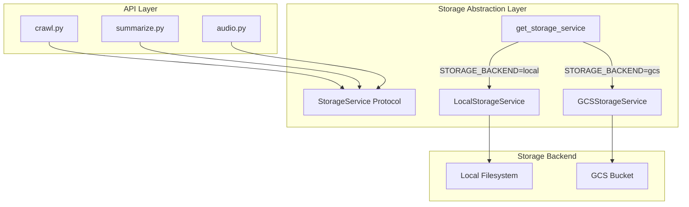

# GCS Storage 마이그레이션 구현 계획

## 아키텍처 개요




## 구현 항목

### 1. 의존성 및 환경변수 추가

[`backend/pyproject.toml`](backend/pyproject.toml)에 `google-cloud-storage` 추가[`backend/app/core/config.py`](backend/app/core/config.py)에 환경변수 추가:

- `STORAGE_BACKEND`: `"local"` | `"gcs"` (기본값: `"local"`)
- `GCS_BUCKET_NAME`: `"read-for-me-data"`
- `GCS_PROJECT_ID`: `"gen-lang-client-0039052673"`
- `GCS_SIGNED_URL_EXPIRY_MINUTES`: `60` (기본값)

### 2. Storage 추상화 레이어 구현

[`backend/app/services/storage.py`](backend/app/services/storage.py) 신규 생성:

```python
# StorageService Protocol
class StorageService(Protocol):
    async def save_json(self, path: str, data: dict) -> str: ...
    async def load_json(self, path: str) -> dict | None: ...
    async def save_bytes(self, path: str, data: bytes) -> str: ...
    async def load_bytes(self, path: str) -> bytes | None: ...
    async def list_files(self, prefix: str, pattern: str) -> list[str]: ...
    async def get_signed_url(self, path: str, expiry_minutes: int) -> str: ...
    def exists(self, path: str) -> bool: ...

# LocalStorageService - 기존 로직 래핑
# GCSStorageService - google-cloud-storage 활용
# get_storage_service() - Factory 함수
```


### 3. 기존 API 수정

파일 I/O 로직을 StorageService로 교체:| 파일 | 수정 내용 ||------|----------|| [`crawl.py`](backend/app/api/v1/crawl.py) | `save_crawl_result()` -> `storage.save_json()` || [`summarize.py`](backend/app/api/v1/summarize.py) | `_save_summary_result()` -> `storage.save_json()` || [`audio.py`](backend/app/api/v1/audio.py) | `_save_script_result()`, `_find_latest_script_json()` -> `storage.save_json()`, `storage.load_json()` || [`audio.py (service)`](backend/app/services/audio.py) | `synthesize_speech()` MP3 저장 -> `storage.save_bytes()` |

### 4. 오디오 서빙 방식 변경

`GET /api/v1/audio/{article_id}.mp3` 엔드포인트:

- **Local**: 기존 `FileResponse` 유지
- **GCS**: Signed URL로 302 Redirect
```python
@router.get("/{article_id}.mp3")
async def get_audio_file(...):
    storage = get_storage_service()
    if isinstance(storage, GCSStorageService):
        signed_url = await storage.get_signed_url(path, expiry_minutes=60)
        return RedirectResponse(url=signed_url, status_code=302)
    else:
        return FileResponse(path=audio_path, ...)
```


### 5. GCS 경로 구조

기존 로컬 구조를 그대로 유지:

```javascript
gs://read-for-me-data/
└── users/{user_id}/
    ├── crawled/{article_id}_{timestamp}.json
    ├── summary/{article_id}_{timestamp}.json
    └── audio/
        ├── {article_id}_{timestamp}.json
        └── {article_id}.mp3
```


## 환경 설정 예시

`.env` 파일:

```bash
# Local 개발
STORAGE_BACKEND=local

# Production (Cloud Run)
STORAGE_BACKEND=gcs
GCS_BUCKET_NAME=read-for-me-data
GCS_PROJECT_ID=gen-lang-client-0039052673
GCS_SIGNED_URL_EXPIRY_MINUTES=60
```


## 기존 인증 활용

이미 [`backend/app/services/audio.py`](backend/app/services/audio.py)에서 사용 중인 `_get_credentials()` 로직을 공유하여, GCS 클라이언트도 동일한 서비스 계정으로 인증합니다.