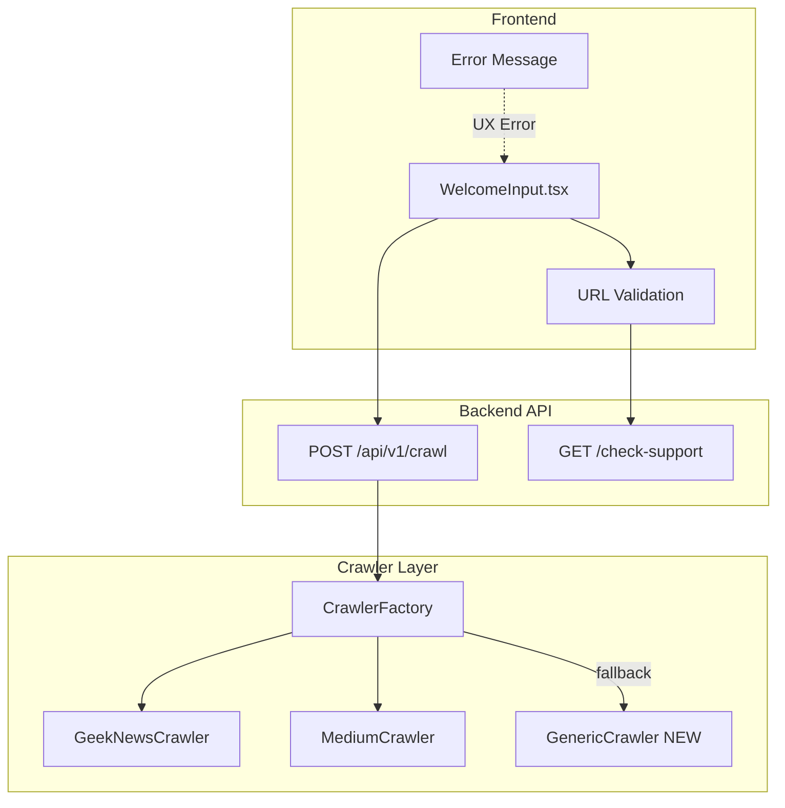

# Phase 5: 범용 크롤러 + 입력 검증 개발 계획

## 1. 아키텍처 개요




## 2. 구현 범위

### 2.1 Backend: 범용 크롤러 개발

**새 파일:** [`backend/app/services/crawlers/generic.py`](backend/app/services/crawlers/generic.py)trafilatura 기반으로 모든 웹사이트에서 본문을 추출하는 범용 크롤러를 구현합니다. GeekNewsCrawler의 `_crawl_original_content()` 로직을 재사용합니다.

```python
class GenericCrawler(BaseCrawler):
    platform_name = "generic"
    
    async def extract(self, url: str) -> Optional[CrawledArticle]:
        # 1. trafilatura로 본문 추출
        # 2. 메타데이터(title, author, date, image) 추출
        # 3. 한국어 사이트 대응: target_language="ko"
```

**핵심 구현 사항:**

- `trafilatura.extract()` 활용 (이미 geeknews.py에서 사용 중)
- `target_language="ko"` 옵션으로 한국어 사이트 최적화
- OG 메타태그 기반 메타데이터 추출
- BeautifulSoup fallback 로직 (trafilatura 실패 시)

### 2.2 CrawlerFactory 수정

**수정 파일:** [`backend/app/services/crawlers/factory.py`](backend/app/services/crawlers/factory.py)

```python
# 변경사항:
# 1. GenericCrawler를 fallback으로 사용
# 2. UnsupportedURLError 대신 GenericCrawler 반환

@classmethod
def get_crawler(cls, url: str, **kwargs) -> BaseCrawler:
    # 기존: 매칭 실패 시 UnsupportedURLError raise
    # 변경: 매칭 실패 시 GenericCrawler 반환 (fallback)
```


### 2.3 에러 타입 세분화

**수정 파일:** [`backend/app/api/v1/crawl.py`](backend/app/api/v1/crawl.py)에러 코드별 사용자 친화적 메시지 매핑:| 상황 | HTTP Status | 에러 메시지 ||------|-------------|-------------|| 잘못된 URL 형식 | 400 | "앗, 올바른 주소인지 확인해 주세요. URL 형식이 필요해요" || 빈 입력 | 400 | "앗, 주소를 입력하지 않으셨어요. 분석할 URL을 넣어주세요." || 크롤링 실패 | 502 | "앗, 페이지 내용을 불러오지 못했어요. 다른 주소로 시도해 주세요." || 콘텐츠 없음 | 422 | "앗, 페이지가 비어 있는 것 같아요. 다른 주소로 다시 시도해 볼까요?" || 타임아웃 | 504 | "앗, 응답 시간이 너무 길어지고 있어요. 잠시 후 다시 시도해 주시겠어요?" || 지원 불가 콘텐츠 | 415 | "앗, 이 페이지의 내용은 읽어오기 어려워요. 일반적인 뉴스나 블로그 주소인가요?" |

### 2.4 Frontend: 입력 검증 UX

**수정 파일:** [`frontend/components/welcome-input.tsx`](frontend/components/welcome-input.tsx)구현 사항:

1. URL 형식 실시간 검증 (입력 중)
2. 에러 메시지 인라인 표시
3. 플랫폼 자동 감지 표시 (예: "GeekNews로 감지됨")
4. 지원 플랫폼 툴팁 추가

**수정 파일:** [`frontend/lib/api.ts`](frontend/lib/api.ts)

- `checkUrlSupport()` 함수 추가 (GET /api/v1/crawl/check-support 호출)
- 에러 응답 타입 확장 (error_code 필드 추가)

## 3. 세부 구현 계획

### Phase 5-1: GenericCrawler 구현

1. `generic.py` 파일 생성
2. trafilatura 기반 본문 추출 로직 구현
3. 메타데이터 추출 (OG 태그, title 태그 등)
4. 한국어 사이트 최적화 (`target_language="ko"`)
5. BeautifulSoup fallback 로직 (기존 geeknews.py 참조)

### Phase 5-2: CrawlerFactory 수정

1. GenericCrawler import 추가
2. `get_crawler()` 메서드에 fallback 로직 추가
3. `is_supported()` 메서드 수정 (generic은 항상 true)
4. 플랫폼 감지 결과 반환 API 개선

### Phase 5-3: 에러 핸들링 시스템

1. 커스텀 예외 클래스 정의 (`CrawlError`, `EmptyContentError`, `TimeoutError` 등)
2. 에러 코드 + 메시지 매핑 딕셔너리
3. API 응답에 `error_code` 필드 추가
4. HTTP 상태 코드 세분화 (400, 415, 422, 502, 504)

### Phase 5-4: Frontend 입력 검증

1. URL 정규식 검증 (입력 중 실시간)
2. 디바운스된 서버 검증 (`/check-support` API)
3. 에러 상태 UI (빨간 테두리, 인라인 메시지)
4. 플랫폼 감지 결과 표시 (Badge 또는 텍스트)

## 4. 테스트 케이스

### 4.1 기존 플랫폼 (전용 크롤러)

| 플랫폼 | URL | 예상 크롤러 | 비고 ||--------|-----|-------------|------|| GeekNews | `https://news.hada.io/topic?id=24268` | GeekNewsCrawler | 기존 지원 || Medium | `https://medium.com/@user/article` | MediumCrawler | 기존 지원 |

### 4.2 GenericCrawler 대상 플랫폼 (우선순위순)

| 우선순위 | 플랫폼 | URL | 예상 동작 | 인증 필요 ||----------|--------|-----|-----------|-----------|| 1 | Naver News | `https://n.news.naver.com/mnews/article/001/0015814209?rc=N&ntype=RANKING` | GenericCrawler 크롤링 성공 | No || 2 | Substack | `https://substack.com/home/post/p-182409140?source=queue` | GenericCrawler 크롤링 (일부 제한 가능) | Maybe || 3 | Turing Post | `https://www.turingpost.com/p/fod132` | GenericCrawler 크롤링 (일부 제한 가능) | Maybe || 4 | a16z (홈) | `https://www.a16z.news` | GenericCrawler 크롤링 | No || 4 | a16z (기사) | `https://www.a16z.news/p/state-of-consumer-ai-2025` | GenericCrawler 크롤링 성공 | No || 5 | Anthropic (홈) | `https://www.anthropic.com` | GenericCrawler 크롤링 | No || 5 | Anthropic (연구) | `https://www.anthropic.com/research/introspection` | GenericCrawler 크롤링 성공 | No || 6 | 조선일보 (홈) | `https://www.chosun.com` | GenericCrawler 크롤링 | No || 6 | 조선일보 (기사) | `https://www.chosun.com/politics/assembly/2025/12/25/NAIQJIMH6ZFZNBDNIUHPBMPUAY/` | GenericCrawler 크롤링 성공 | No || 7 | 한겨레 (홈) | `https://www.hani.co.kr` | GenericCrawler 크롤링 | No || 7 | 한겨레 (기사) | `https://www.hani.co.kr/arti/politics/politics_general/1236502.html` | GenericCrawler 크롤링 성공 | No |

### 4.3 에러 케이스

| 입력 | HTTP Status | 에러 코드 | 에러 메시지 ||------|-------------|-----------|-------------|| `invalid-text` | 400 | `INVALID_URL_FORMAT` | "앗, 올바른 주소인지 확인해 주세요. URL 형식이 필요해요" || (빈 입력) | 400 | `EMPTY_INPUT` | "앗, 주소를 입력하지 않으셨어요. 분석할 URL을 넣어주세요." || `https://example.com/empty` | 422 | `NO_CONTENT` | "앗, 페이지가 비어 있는 것 같아요. 다른 주소로 다시 시도해 볼까요?" || `https://example.com/timeout` | 504 | `TIMEOUT` | "앗, 응답 시간이 너무 길어지고 있어요. 잠시 후 다시 시도해 주시겠어요?" || `https://youtube.com/watch?v=xxx` | 415 | `UNSUPPORTED_CONTENT` | "앗, 이 페이지의 내용은 읽어오기 어려워요. 일반적인 뉴스나 블로그 주소인가요?" || `https://blocked-site.com` | 502 | `CRAWL_FAILED` | "앗, 페이지 내용을 불러오지 못했어요. 다른 주소로 시도해 주세요." |

### 4.4 테스트 우선순위

**Phase 5 완료 시 반드시 검증해야 할 항목:**

1. Naver News 기사 크롤링 성공 여부
2. 조선일보/한겨레 등 한국 뉴스 사이트 호환성
3. 잘못된 URL 형식 입력 시 에러 메시지 표시
4. 빈 입력 시 에러 메시지 표시
5. 플랫폼 자동 감지 결과 Frontend 표시