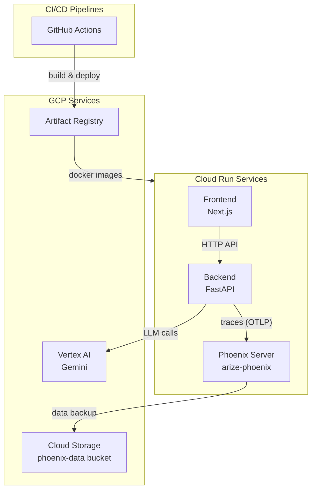
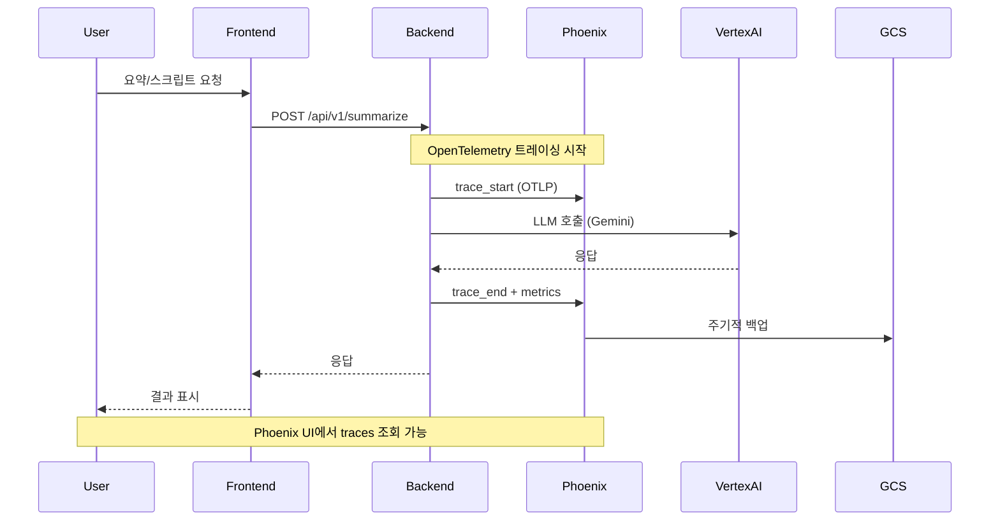

# Phoenix LLMOps 통합 계획

## 아키텍처 개요




## 데이터 흐름



---

## Phase 1: Phoenix 서버 구축

### 1.1 Phoenix 전용 디렉토리 생성

새 디렉토리 구조:

```javascript
/phoenix/
  Dockerfile
  requirements.txt
  cloudbuild.yaml
```


### 1.2 Phoenix Dockerfile 작성

```dockerfile
FROM python:3.11-slim

WORKDIR /app

# 필수 패키지 설치
RUN pip install arize-phoenix[experimental]

# GCS FUSE 설치 (Cloud Storage 마운트용)
RUN apt-get update && apt-get install -y \
    curl gnupg lsb-release && \
    echo "deb https://packages.cloud.google.com/apt gcsfuse-buster main" | \
    tee /etc/apt/sources.list.d/gcsfuse.list && \
    curl https://packages.cloud.google.com/apt/doc/apt-key.gpg | \
    apt-key add - && \
    apt-get update && apt-get install -y gcsfuse && \
    apt-get clean

# 데이터 디렉토리
ENV PHOENIX_WORKING_DIR=/data/phoenix
RUN mkdir -p /data/phoenix

# 포트 노출
EXPOSE 6006

# 시작 스크립트
COPY entrypoint.sh /entrypoint.sh
RUN chmod +x /entrypoint.sh

ENTRYPOINT ["/entrypoint.sh"]
```


### 1.3 Cloud Build 설정

```yaml
# phoenix/cloudbuild.yaml
steps:
    - name: 'gcr.io/cloud-builders/docker'
    args: ['build', '-t', '${_REGION}-docker.pkg.dev/$PROJECT_ID/readforme/phoenix:$COMMIT_SHA', '.']
    dir: 'phoenix'
    - name: 'gcr.io/cloud-builders/docker'
    args: ['push', '${_REGION}-docker.pkg.dev/$PROJECT_ID/readforme/phoenix:$COMMIT_SHA']
    - name: 'gcr.io/google.com/cloudsdktool/cloud-sdk'
    entrypoint: gcloud
    args:
            - 'run'
            - 'deploy'
            - 'phoenix'
            - '--image=${_REGION}-docker.pkg.dev/$PROJECT_ID/readforme/phoenix:$COMMIT_SHA'
            - '--region=${_REGION}'
            - '--execution-environment=gen2'
            - '--add-volume=name=phoenix-data,type=cloud-storage,bucket=${_GCS_BUCKET}'
            - '--add-volume-mount=volume=phoenix-data,mount-path=/data/phoenix'

substitutions:
  _REGION: asia-northeast3
  _GCS_BUCKET: readforme-phoenix-data
```

---

## Phase 2: Backend 트레이싱 통합

### 2.1 의존성 추가

[`backend/pyproject.toml`](backend/pyproject.toml) 수정:

```toml
dependencies = [
    # ... 기존 의존성 ...
    "arize-phoenix[otel]>=5.0.0",
    "opentelemetry-instrumentation-langchain>=0.30.0",
]
```


### 2.2 트레이싱 설정 모듈 생성

새 파일 `backend/app/core/tracing.py`:

```python
"""
Phoenix 트레이싱 설정 모듈
"""
import os
from phoenix.otel import register
from openinference.instrumentation.langchain import LangChainInstrumentor

def setup_tracing():
    """Phoenix 트레이싱을 초기화합니다."""
    phoenix_endpoint = os.environ.get(
        "PHOENIX_COLLECTOR_ENDPOINT",
        "http://localhost:6006/v1/traces"
    )
    
    tracer_provider = register(
        project_name="readforme",
        endpoint=phoenix_endpoint,
    )
    
    # LangChain 자동 계측
    LangChainInstrumentor().instrument(tracer_provider=tracer_provider)
    
    return tracer_provider
```


### 2.3 main.py 수정

[`backend/app/main.py`](backend/app/main.py)에 트레이싱 초기화 추가:

```python
from app.core.tracing import setup_tracing

# 앱 시작 시 트레이싱 초기화
tracer_provider = setup_tracing()
```


### 2.4 config.py 환경변수 추가

[`backend/app/core/config.py`](backend/app/core/config.py) 수정:

```python
class Settings(BaseSettings):
    # ... 기존 설정 ...
    
    # Phoenix 트레이싱 설정
    PHOENIX_ENABLED: bool = True
    PHOENIX_COLLECTOR_ENDPOINT: str = "http://phoenix:6006/v1/traces"
    PHOENIX_PROJECT_NAME: str = "readforme"
```

---

## Phase 3: GCP 인프라 설정

### 3.1 Cloud Storage 버킷 생성

```bash
gcloud storage buckets create gs://readforme-phoenix-data \
    --location=asia-northeast3 \
    --uniform-bucket-level-access
```


### 3.2 서비스 계정 권한 설정

```bash
# Cloud Run 서비스 계정에 GCS 권한 부여
gcloud projects add-iam-policy-binding $PROJECT_ID \
    --member="serviceAccount:$SERVICE_ACCOUNT" \
    --role="roles/storage.objectAdmin"
```


### 3.3 VPC Connector 설정 (서비스 간 통신)

```bash
gcloud compute networks vpc-access connectors create readforme-connector \
    --region=asia-northeast3 \
    --range=10.8.0.0/28
```

---

## Phase 4: CI/CD 파이프라인

### 4.1 GitHub Actions 워크플로우 구성

3개의 독립적 파이프라인:

1. **frontend.yml**: Frontend 빌드/배포
2. **backend.yml**: Backend 빌드/배포
3. **phoenix.yml**: Phoenix 빌드/배포 (신규)

### 4.2 Phoenix 배포 워크플로우

새 파일 `.github/workflows/phoenix.yml`:

```yaml
name: Deploy Phoenix

on:
  push:
    paths:
            - 'phoenix/**'
    branches: [main]

jobs:
  deploy:
    runs-on: ubuntu-latest
    steps:
            - uses: actions/checkout@v4
            - uses: google-github-actions/auth@v2
        with:
          credentials_json: ${{ secrets.GCP_SA_KEY }}
            - name: Deploy to Cloud Run
        run: |
          gcloud builds submit phoenix/ \
            --config=phoenix/cloudbuild.yaml
```

---

## Phase 5: 검증 및 테스트

### 5.1 로컬 테스트

```bash
# Phoenix 로컬 실행
docker run -p 6006:6006 phoenix:local

# Backend 환경변수 설정
export PHOENIX_COLLECTOR_ENDPOINT=http://localhost:6006/v1/traces

# Backend 실행 후 API 호출
curl -X POST http://localhost:8000/api/v1/summarize \
  -H "Content-Type: application/json" \
  -d '{"content": "테스트 콘텐츠..."}'

# Phoenix UI 확인
open http://localhost:6006
```


### 5.2 통합 테스트 체크리스트

- [ ] Backend -> Phoenix 트레이스 전송 확인
- [ ] Phoenix UI에서 LLM 호출 로그 조회
- [ ] 토큰 사용량, latency 메트릭 확인
- [ ] GCS 데이터 백업 확인

---

## 파일 변경 요약

| 작업 | 파일 | 설명 ||------|------|------|| 신규 | `phoenix/Dockerfile` | Phoenix 서버 컨테이너 || 신규 | `phoenix/requirements.txt` | Phoenix 의존성 || 신규 | `phoenix/cloudbuild.yaml` | Cloud Build 설정 || 신규 | `phoenix/entrypoint.sh` | 시작 스크립트 || 신규 | `backend/app/core/tracing.py` | 트레이싱 설정 모듈 || 신규 | `.github/workflows/phoenix.yml` | Phoenix CI/CD || 수정 | `backend/pyproject.toml` | Phoenix 의존성 추가 |