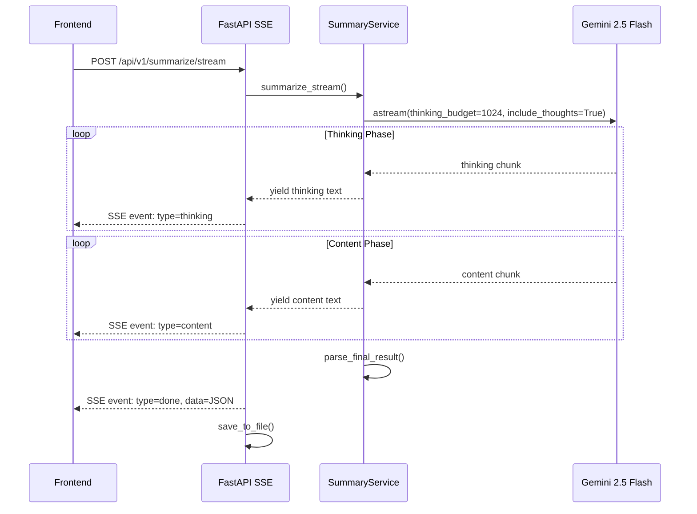

# Streaming 응답 + Thinking Step 구현 계획

## 개요

요약 서비스에 SSE(Server-Sent Events) 기반 스트리밍과 Gemini 2.5의 Thinking 기능을 통합합니다.**핵심 결정 사항:**

- **스트리밍 방식**: Plain Text Streaming → 최종 JSON 변환
- **Thinking 표시**: UI에 실시간 표시 (투명한 AI 추론 과정 공개)
- **통신 프로토콜**: SSE (Server-Sent Events)

---

## 아키텍처



---

## 구현 상세

### 1. Backend - SSE 엔드포인트 ([backend/app/api/v1/summarize.py](backend/app/api/v1/summarize.py))

**새 엔드포인트 추가:**

```python
from fastapi.responses import StreamingResponse

@router.post("/stream")
async def summarize_stream(request: SummarizeRequest) -> StreamingResponse:
    """SSE 스트리밍 요약 엔드포인트"""
    return StreamingResponse(
        _generate_sse_events(request),
        media_type="text/event-stream",
        headers={
            "Cache-Control": "no-cache",
            "Connection": "keep-alive",
        }
    )
```

**SSE 이벤트 형식:**

```javascript
event: thinking
data: {"text": "글의 핵심을 파악하고 있습니다..."}

event: content  
data: {"text": "• AI 시대 소프트웨어 시장"}

event: done
data: {"bullet_points": [...], "main_topic": "...", "model": "...", "processing_time_ms": 1234}
```


### 2. SummaryService - 스트리밍 메서드 ([backend/app/services/summary.py](backend/app/services/summary.py))

**새 메서드 추가:**

```python
async def summarize_stream(
    self,
    content: str,
    original_content: str | None = None,
) -> AsyncGenerator[tuple[str, str], None]:
    """
    스트리밍 요약 생성
    
    Yields:
        (event_type, text) 튜플
    - event_type: "thinking" | "content"
    - text: 스트리밍된 텍스트 청크
    """
```

**ChatGoogleGenerativeAI 설정:**

```python
self.llm_streaming = ChatGoogleGenerativeAI(
    model="gemini-2.5-flash",
    thinking_budget=1024,      # Thinking 토큰 예산
    include_thoughts=True,     # Thinking 출력 포함
    streaming=True,
)
```


### 3. 프롬프트 수정 ([backend/prompts/v1/summary_stream.md](backend/prompts/v1/summary_stream.md))

**Plain Text 출력 형식 지시:**

```markdown
## 출력 형식

다음 형식으로 정확히 출력해주세요:

[주제]
{한 줄 주제 요약}

[요약]
• {첫 번째 핵심 포인트}
• {두 번째 핵심 포인트}
• {세 번째 핵심 포인트}
```


### 4. Frontend - SSE 클라이언트 ([frontend/lib/api.ts](frontend/lib/api.ts))

**새 함수 추가:**

```typescript
export async function* summarizeStream(
  request: SummarizeRequest
): AsyncGenerator<StreamEvent> {
  const response = await fetch(`${API_BASE}/api/v1/summarize/stream`, {
    method: "POST",
    headers: { "Content-Type": "application/json" },
    body: JSON.stringify(request),
  });
  
  const reader = response.body?.getReader();
  // SSE 파싱 로직...
}

interface StreamEvent {
  type: "thinking" | "content" | "done" | "error";
  data: string | SummarizeResponse;
}
```


### 5. InsightCard 컴포넌트 ([frontend/components/insight-card.tsx](frontend/components/insight-card.tsx))

**새 상태 및 UI:**

```typescript
interface InsightCardProps {
  // 기존 props...
  streamingThinking?: string;   // 실시간 thinking 텍스트
  streamingContent?: string;    // 실시간 content 텍스트
  isStreaming?: boolean;
}
```

**UI 구조:**

```javascript
┌─────────────────────────────────────────┐
│ 🧠 AI가 분석 중...                       │  ← Thinking Phase
│ ┌─────────────────────────────────────┐ │
│ │ 글의 핵심 논점을 파악하고 있습니다.    │ │  (collapsible)
│ │ 주요 기술 트렌드를 정리 중입니다...    │ │
│ └─────────────────────────────────────┘ │
├─────────────────────────────────────────┤
│ ✨ AI 3줄 요약                           │  ← Content Phase
│                                         │
│ 주제: AI 시대의 소프트웨어 시장 변화     │
│                                         │
│ ✓ AI 시대 소프트웨어 시장, 단순 IT 지출  │
│   을 넘어 노동 대체 중심으로 확장 중|    │  (타이핑 효과)
└─────────────────────────────────────────┘
```

---

## 파일 변경 목록

| 파일 | 변경 내용 ||------|----------|| `backend/app/api/v1/summarize.py` | `POST /stream` 엔드포인트 추가 || `backend/app/services/summary.py` | `summarize_stream()` 메서드 추가, thinking 설정 || `backend/prompts/v1/summary_stream.md` | Plain text 출력용 새 프롬프트 || `frontend/lib/api.ts` | `summarizeStream()` SSE 클라이언트 함수 || `frontend/app/page.tsx` | 스트리밍 상태 관리 로직 || `frontend/components/insight-card.tsx` | Thinking/Content 실시간 UI |---

## 주요 고려 사항

### 에러 처리

- SSE 연결 끊김 시 자동 재연결 또는 fallback (기존 non-streaming API)
- LLM 응답 파싱 실패 시 원본 텍스트 표시

### 성능

- Thinking 토큰은 과금되지만 품질 향상에 기여
- `thinking_budget=1024` 기본값 (조정 가능)

### 하위 호환성