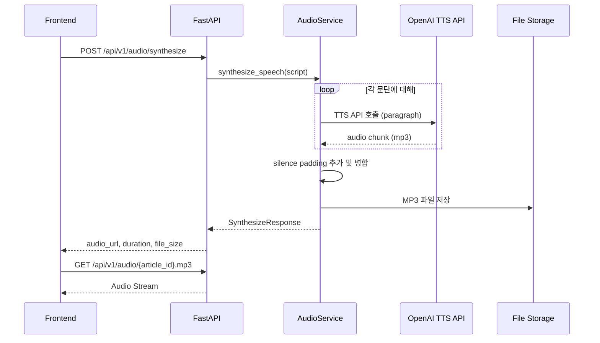

# TTS 음성 합성 개발 계획

## 개요

OpenAI TTS API (`gpt-4o-mini-tts`)를 사용하여 생성된 뉴스 스크립트를 음성으로 합성합니다. 문단별로 TTS를 호출하고, silence padding을 추가하여 자연스러운 오디오 파일을 생성합니다.

## 아키텍처




## 구현 단계

### 1. Backend - 의존성 및 설정 추가

**파일: [`backend/pyproject.toml`](backend/pyproject.toml)**

- `pydub` 라이브러리 추가 (오디오 병합용)

**파일: [`backend/app/core/config.py`](backend/app/core/config.py)**

- OpenAI TTS 관련 환경변수 추가:
- `OPENAI_API_KEY`: OpenAI API 키
- `TTS_MODEL`: 모델 (기본값: `gpt-4o-mini-tts`)
- `TTS_VOICE`: 음성 (기본값: `marin`)
- `TTS_SILENCE_PADDING_MS`: 문단 사이 silence 길이 (기본값: `500`)
- `TTS_INSTRUCTIONS`: TTS 지시사항 (기본값: 한국어 뉴스 아나운서 톤)

### 2. Backend - TTS 서비스 구현

**파일: [`backend/app/services/audio.py`](backend/app/services/audio.py)**AudioService 클래스에 다음 메서드 추가:

```python
async def synthesize_speech(self, script: NewsScript, article_id: str, user_id: str) -> dict:
    """
    뉴스 스크립트를 음성으로 합성합니다.
    
    1. 각 문단을 OpenAI TTS API로 합성
    2. 문단 사이에 silence padding 추가
    3. 전체 오디오 병합 후 MP3 저장
    
    Returns:
        {"audio_path": Path, "duration_sec": float, "file_size_bytes": int}
    """

async def _call_openai_tts(self, text: str) -> bytes:
    """단일 텍스트를 TTS로 변환"""

def _merge_audio_chunks(self, chunks: list[bytes], silence_ms: int) -> bytes:
    """오디오 청크들을 silence padding과 함께 병합"""
```


### 3. Backend - API 엔드포인트 추가

**파일: [`backend/app/api/v1/audio.py`](backend/app/api/v1/audio.py)**

```python
# 요청/응답 스키마 추가
class SynthesizeRequest(BaseModel):
    article_id: str
    user_id: str | None = None

class SynthesizeResponse(BaseModel):
    audio_url: str          # /api/v1/audio/{article_id}.mp3
    duration_seconds: float
    file_size_bytes: int
    user_id: str
    article_id: str

# 엔드포인트 추가
@router.post("/synthesize")
async def synthesize_audio(request: SynthesizeRequest) -> SynthesizeResponse:
    """저장된 스크립트를 기반으로 TTS 음성 합성"""

@router.get("/{article_id}.mp3")
async def get_audio_file(article_id: str, user_id: str = "default"):
    """생성된 오디오 파일 스트리밍"""
```


### 4. Frontend - API 클라이언트 추가

**파일: [`frontend/lib/api.ts`](frontend/lib/api.ts)**

```typescript
// 타입 추가
interface SynthesizeRequest {
  article_id: string;
  user_id?: string;
}

interface SynthesizeResponse {
  audio_url: string;
  duration_seconds: number;
  file_size_bytes: number;
  user_id: string;
  article_id: string;
}

// 함수 추가
export async function synthesizeAudio(request: SynthesizeRequest): Promise<SynthesizeResponse>
export function getAudioUrl(articleId: string, userId?: string): string
```


### 5. Frontend - 오디오 플레이어 활성화

**파일: [`frontend/components/audio-player-card.tsx`](frontend/components/audio-player-card.tsx)**

- TTS 합성 상태 추가 (`synthesizing`, `ready`, `playing`, `paused`)
- 실제 `<audio>` 요소 연결
- 재생/일시정지 버튼 활성화
- 프로그레스 바 연동 (현재 재생 위치)
- 다운로드 버튼 활성화

### 6. Frontend - 파이프라인 연동

**파일: [`frontend/app/page.tsx`](frontend/app/page.tsx)**스크립트 생성 완료 후 자동으로 TTS 합성 호출:

```typescript
// 스크립트 생성 완료 시
onDone: (result) => {
  setScriptData(result);
  setAudioStatus("synthesizing");
  // TTS 합성 호출
  synthesizeAudio({ article_id: result.article_id })
    .then((response) => {
      setAudioUrl(response.audio_url);
      setAudioStatus("ready");
    });
}
```


## 파일 저장 구조

```javascript
data/users/{user_id}/audio/
├── {article_id}_{timestamp}.json    # 스크립트 메타데이터 (기존)
└── {article_id}.mp3                 # TTS 오디오 파일 (신규)
```


## 환경변수 설정 예시

```env
# OpenAI TTS 설정
OPENAI_API_KEY=sk-...
TTS_MODEL=gpt-4o-mini-tts
TTS_VOICE=marin
TTS_SILENCE_PADDING_MS=500
TTS_INSTRUCTIONS=차분하고 전문적인 한국어 뉴스 아나운서 톤으로 읽어주세요.


```