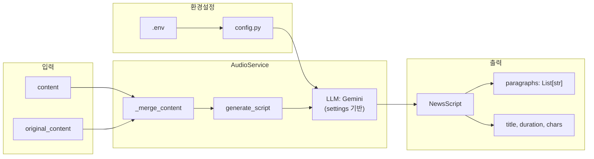

# Step 1: 뉴스 스크립트 생성 서비스 구현

## 1. 요구사항 분석

### 기능 요구사항

- 크롤링된 콘텐츠를 **3분 분량**(약 900~1,050자)의 뉴스 리포팅 대본으로 변환
- **남성 아나운서 톤**의 뉴스 리포팅 스타일
- OpenAI TTS API 길이 제한 대응을 위해 **문단별 분리** 출력 (`List[str]`)

### 입력 데이터

- 요약 서비스(`SummaryService`)와 동일한 입력 구조
- GeekNews: `content` + `original_content` 병합 사용

### 출력 데이터 (구조화된 객체)

```python
class NewsScript(BaseModel):
    paragraphs: list[str]        # 문단별 스크립트 (8~12개, TTS 청킹용)
    title: str                   # 뉴스 헤드라인
    estimated_duration_sec: int  # 예상 분량 (초)
    total_characters: int        # 총 글자 수
```

---

## 2. 의사결정 사항 (확정)

| 항목 | 결정 | 근거 |

|------|------|------|

| 입력 소스 | `content` + `original_content` 병합 | 요약 서비스와 동일한 패턴 |

| 출력 형식 | 구조화된 객체 + 문단별 `List[str]` | TTS 청킹 및 silence padding 병합 대응 |

| 문단 수 | 8~12개 | 3분 / 15~20초/문단 = 약 10개 문단 |

| 문단당 글자 | 80~120자 | OpenAI TTS 권장 청크 크기 내 |

| LLM 설정 | 환경변수로 독립 관리 | SummaryService와 분리 |---

## 3. 환경변수 설정 (SummaryService와 분리)

AudioService 전용 환경변수를 정의하여 SummaryService와 독립적으로 설정을 관리합니다.

### 3-1. `.env` 파일 추가 항목

```bash
# ===========================================
# AudioService (뉴스 스크립트 생성) 설정
# SummaryService 설정과 별도로 관리
# ===========================================
AUDIO_SCRIPT_MODEL=gemini-2.5-flash
AUDIO_SCRIPT_THINKING_LEVEL=low
AUDIO_SCRIPT_THINKING_BUDGET=2048
AUDIO_SCRIPT_INCLUDE_THOUGHTS=false
AUDIO_SCRIPT_TEMPERATURE=0.5
```


### 3-2. [`config.py`](backend/app/core/config.py) Settings 클래스 추가 필드

```python
class Settings(BaseSettings):
    # ... 기존 설정 유지 ...

    # Gemini Thinking 설정 (SummaryService용) - 기존
    GEMINI_THINKING_LEVEL: str = "low"
    GEMINI_THINKING_BUDGET: int = 2048

    # ===== AudioService (뉴스 스크립트 생성) 전용 설정 - 신규 =====
    AUDIO_SCRIPT_MODEL: str = "gemini-2.5-flash"
    AUDIO_SCRIPT_THINKING_LEVEL: str = "low"
    AUDIO_SCRIPT_THINKING_BUDGET: int = 2048
    AUDIO_SCRIPT_INCLUDE_THOUGHTS: bool = False
    AUDIO_SCRIPT_TEMPERATURE: float = 0.5  # 대본 생성은 약간의 창의성 허용
```


### 3-3. AudioService에서 설정 사용 패턴

```python
# app/services/audio.py
from app.core.config import settings

class AudioService:
    def __init__(self):
        # settings에서 AudioService 전용 설정 로드
        self.model_name = settings.AUDIO_SCRIPT_MODEL
        self.thinking_level = settings.AUDIO_SCRIPT_THINKING_LEVEL
        self.thinking_budget = (
            settings.AUDIO_SCRIPT_THINKING_BUDGET 
            if self.thinking_level.lower() != "off" 
            else 0
        )
        self.include_thoughts = settings.AUDIO_SCRIPT_INCLUDE_THOUGHTS
        self.temperature = settings.AUDIO_SCRIPT_TEMPERATURE
        
        # LLM 초기화 (settings 값 사용)
        self.llm = ChatGoogleGenerativeAI(
            model=self.model_name,
            temperature=self.temperature,
            thinking_budget=self.thinking_budget,
            include_thoughts=self.include_thoughts,
            credentials=credentials,
            project=self.project_id,
        )
```

---

## 4. 구현 계획

### 4-1. Output Schema 정의

- 파일: [`backend/output_schemas/audio.py`](backend/output_schemas/audio.py) (신규)
- `NewsScript` Pydantic 모델 정의
- LangChain `with_structured_output()` 호환

### 4-2. 프롬프트 템플릿 작성

- 파일: [`backend/prompts/v1/news_script.md`](backend/prompts/v1/news_script.md) (신규)
- 핵심 지시사항:
- 3분 분량 (총 900~1,050자)
- 8~12개 문단으로 분리
- 남성 뉴스 아나운서 톤
- 구어체 (청취자 친화적)
- 원본에 없는 내용 추가 금지

### 4-3. AudioService 구현 (Step 1만)

- 파일: [`backend/app/services/audio.py`](backend/app/services/audio.py) (신규)
- 기존 `SummaryService` 패턴 참조
- 핵심 메서드:
```python
class AudioService:
    async def generate_script(
        self,
        content: str,
        original_content: str | None = None,
    ) -> NewsScript:
        """콘텐츠를 뉴스 스크립트로 변환"""
        ...
```


- 포함 기능:
- `_merge_content()`: content + original_content 병합 (SummaryService 로직 재사용)
- tenacity 재시도 로직
- 로깅

### 4-4. API 엔드포인트 구현

- 파일: [`backend/app/api/v1/audio.py`](backend/app/api/v1/audio.py) (신규)
- 엔드포인트: `POST /api/v1/audio/script`
```python
# Request
class GenerateScriptRequest(BaseModel):
    content: str
    original_content: str | None = None
    article_id: str | None = None
    user_id: str = "default"

# Response
class GenerateScriptResponse(BaseModel):
    user_id: str
    article_id: str
    script: NewsScript
    model: str
    processing_time_ms: int
```


### 4-5. 라우터 등록

- 파일: [`backend/app/main.py`](backend/app/main.py)
- audio 라우터 추가

---

## 5. 파일 구조 (변경 사항)

```javascript
backend/
├── .env                       # 🔧 AUDIO_SCRIPT_* 환경변수 추가
├── app/core/
│   └── config.py              # 🔧 AudioService 설정 필드 추가
├── output_schemas/
│   ├── summary.py             # 기존
│   └── audio.py               # 🆕 NewsScript 스키마
├── prompts/v1/
│   ├── summary.md             # 기존
│   ├── summary_stream.md      # 기존
│   └── news_script.md         # 🆕 뉴스 대본 프롬프트
└── app/
    ├── services/
    │   ├── summary.py         # 기존
    │   └── audio.py           # 🆕 AudioService
    └── api/v1/
        ├── summarize.py       # 기존
        └── audio.py           # 🆕 audio 엔드포인트
```

---

## 6. 데이터 흐름 다이어그램



---

## 7. 향후 Step 2 연동 (참고)

Step 1 완료 후, Step 2(TTS)에서 다음과 같이 연동:

```python
# Step 2 예시 (구현 예정)
async def synthesize_audio(script: NewsScript) -> bytes:
    audio_chunks = []
    for paragraph in script.paragraphs:
        chunk = await openai_tts(paragraph)
        audio_chunks.append(chunk)
    
    # silence padding + merge
    return merge_with_silence(audio_chunks, padding_ms=400)

```