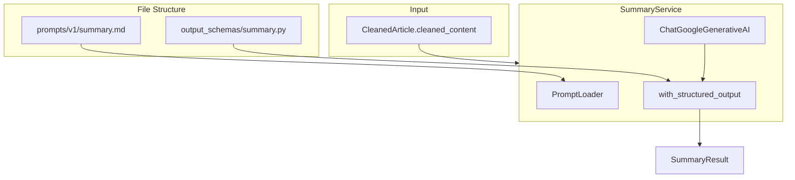

# 요약 서비스 LangChain 구현 계획

## 아키텍처 개요




## 디렉토리 구조

```javascript
backend/
├── prompts/
│   └── v1/
│       └── summary.md              # 요약 프롬프트 템플릿
├── output_schemas/
│   ├── __init__.py
│   └── summary.py                  # SummaryResult Pydantic 스키마
├── app/
│   ├── services/
│   │   ├── summary.py              # SummaryService 구현
│   │   └── prompt_loader.py        # 프롬프트 로더 유틸리티
│   └── api/v1/
│       └── summarize.py            # POST /api/v1/summarize 엔드포인트
├── pyproject.toml                  # langchain-google-genai 의존성 추가
└── .env                            # GOOGLE_API_KEY 환경변수
```


## 핵심 구현 사항

### 1. 의존성 추가 ([pyproject.toml](backend/pyproject.toml))

`langchain-google-genai` 패키지를 추가합니다.

### 2. 출력 스키마 정의 (output_schemas/summary.py)

```python
from pydantic import BaseModel, Field

class SummaryResult(BaseModel):
    """요약 결과 스키마"""
    bullet_points: list[str] = Field(
        ..., 
        min_length=3, 
        max_length=5,
        description="핵심 포인트 요약 (3-5개)"
    )
    main_topic: str = Field(..., description="주요 주제 한 줄 요약")
```


### 3. 프롬프트 템플릿 (prompts/v1/summary.md)

마크다운 파일로 프롬프트를 관리하여 버전 관리 및 A/B 테스트가 용이하도록 합니다.

### 4. SummaryService 구현 (backend/app/services/summary.py)

- `ChatGoogleGenerativeAI` 모델 초기화
- `with_structured_output(SummaryResult)` 로 Structured Output 적용
- 프롬프트 로더를 통해 마크다운 파일에서 프롬프트 로드
- 비동기 `ainvoke()` 메서드로 요약 생성

### 5. API 엔드포인트 (backend/app/api/v1/summarize.py)

- `POST /api/v1/summarize`: 콘텐츠를 받아 요약 결과 반환
- 요청/응답 스키마 정의
- 에러 핸들링 (API 키 누락, 모델 오류 등)

## 구현 순서

1. **의존성 설치**: `langchain-google-genai` 추가
2. **출력 스키마 생성**: `output_schemas/` 디렉토리 및 스키마 파일
3. **프롬프트 파일 생성**: `prompts/v1/summary.md`
4. **프롬프트 로더 구현**: 마크다운 파일 로드 유틸리티
5. **SummaryService 구현**: LangChain 기반 요약 서비스
6. **API 엔드포인트 추가**: FastAPI 라우터 연결
7. **config.py 업데이트**: GOOGLE_API_KEY 설정 추가 (선택적)

## 사용 예시

```python
# API 호출
POST /api/v1/summarize
{
  "content": "정제된 콘텐츠...",
  "url": "https://..." # 캐싱용 (선택)
}

# 응답
{
  "bullet_points": [
    "첫 번째 핵심 포인트",
    "두 번째 핵심 포인트",
    "세 번째 핵심 포인트"
  ],
  "main_topic": "주요 주제 한 줄 요약",
  "model": "gemini-2.5-flash",
  "processing_time_ms": 1234
}


```