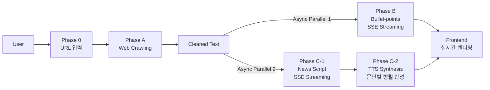

## 📝 Project PRD: Read-For-Me (MVP) v2.0

> **마지막 업데이트:** 2025-12-25
> **버전 히스토리:** v1.3 (초기 기획) → v2.0 (MVP 완료 + 향후 로드맵)

---

### 1. 프로젝트 개요

- **프로젝트명:** Read-For-Me (RFM)
- **핵심 가치:** "Running & Learning" - 기사를 읽을 시간이 없는 사용자를 위해, 핵심 요약과 오디오 리포팅을 제공한다.
- **MVP 목표:** URL 입력 시 ①기사 원문 정보, ②핵심 요약, ③오디오 리포팅 3가지 콘텐츠를 생성하여 제공한다.
- **UI 전략:** **싱글 컬럼 Minimal UI** (타이포그래피 중심) + Mobile Responsive

---

### 2. 현재 구현 상태 (MVP v1.0 완료)

#### 2.1 핵심 기능 달성률: ✅ 100%

| 목표            | 상태    | 구현 내용                                                    |
| --------------- | ------- | ------------------------------------------------------------ |
| ①기사 원문 정보 | ✅ 완료 | `SourcePanel` - 크롤링 + 메타데이터 + 원문 미리보기          |
| ②핵심 요약      | ✅ 완료 | `InsightCard` - 3줄 요약 + AI Thinking 스트리밍              |
| ③오디오 리포팅  | ✅ 완료 | `AudioPlayerCard` - 스크립트 생성 + TTS 합성 + 재생/다운로드 |

#### 2.2 지원 플랫폼

| 플랫폼        | 상태    | 특징                                       |
| ------------- | ------- | ------------------------------------------ |
| GeekNews      | ✅ 완료 | 토픽 + 원본 외부 링크 크롤링 (trafilatura) |
| Medium        | ✅ 완료 | Freedium 미러 활용                         |
| 일반 웹사이트 | 🔜 예정 | 범용 크롤러 개발 예정                      |

---

### 3. System Architecture

#### 3.1 High-Level Architecture

```
┌─────────────────────────────────────────────────────────────────┐
│                        Frontend (Next.js 15)                     │
│  ┌─────────────────┐  ┌─────────────────┐  ┌─────────────────┐  │
│  │  WelcomeInput   │  │   InsightCard   │  │ AudioPlayerCard │  │
│  │  (URL 입력)     │  │  (요약 스트리밍) │  │  (오디오 재생)  │  │
│  └─────────────────┘  └─────────────────┘  └─────────────────┘  │
└────────────────────────────┬────────────────────────────────────┘
                             │ REST + SSE Streaming
                             ▼
┌─────────────────────────────────────────────────────────────────┐
│                       Backend (FastAPI)                          │
│  ┌─────────────┐  ┌─────────────┐  ┌─────────────────────────┐  │
│  │   Crawlers  │  │   Summary   │  │       Audio Service     │  │
│  │  GeekNews   │  │   Service   │  │  Script + TTS Synthesis │  │
│  │  Medium     │  │  (Gemini)   │  │   (Gemini + OpenAI)     │  │
│  └─────────────┘  └─────────────┘  └─────────────────────────┘  │
└─────────────────────────────────────────────────────────────────┘
                             │
              ┌──────────────┴──────────────┐
              ▼                              ▼
     ┌─────────────────┐            ┌─────────────────┐
     │   Gemini 2.5    │            │   OpenAI TTS    │
     │   Flash + Think │            │  gpt-4o-mini    │
     └─────────────────┘            └─────────────────┘
```

#### 3.2 기술 스택

| 영역         | 기술                               | 비고                          |
| ------------ | ---------------------------------- | ----------------------------- |
| **Frontend** | Next.js 15 (App Router)            | Tailwind CSS, Geist 폰트      |
| **Backend**  | FastAPI (Python 3.12)              | uv 패키지 관리                |
| **LLM**      | Gemini 2.5 Flash + Thinking        | Vertex AI 인증                |
| **TTS**      | OpenAI gpt-4o-mini-tts             | 문단별 병렬 합성 + pydub 병합 |
| **크롤링**   | httpx, BeautifulSoup4, trafilatura | 플랫폼별 크롤러 팩토리        |
| **스트리밍** | SSE (Server-Sent Events)           | thinking + content 분리       |

#### 3.3 User Flow (Parallel Processing)



**핵심 특징:**

- **병렬 스트리밍:** 요약과 스크립트 생성이 동시에 SSE로 스트리밍
- **AI Thinking 표시:** Gemini의 추론 과정을 실시간으로 사용자에게 표시
- **문단별 TTS 병렬화:** 8~12개 문단을 병렬로 TTS 합성 후 pydub로 병합

---

### 4. 화면 구성 (현재 구현)

#### 4.1 Layout Strategy

- **Desktop/Mobile 공통:** 싱글 컬럼 (max-width: 680px, 중앙 정렬)
- **URL 입력창 동적 배치:**
  - `idle` 상태: 화면 중앙에 큰 입력창 (`WelcomeInput`)
  - `processing/done` 상태: Header로 이동 (컴팩트 입력창)

#### 4.2 주요 컴포넌트

| 컴포넌트          | 역할            | 주요 기능                              |
| ----------------- | --------------- | -------------------------------------- |
| `Header`          | 상단 네비게이션 | 로고, 동적 URL 입력, 다크모드 토글     |
| `WelcomeInput`    | 초기 입력 화면  | 중앙 배치 URL 입력, CTA                |
| `SourcePanel`     | 원문 정보       | 메타데이터, 원문 미리보기 Collapsible  |
| `InsightCard`     | AI 요약         | Thinking 스트리밍, 실시간 bullet point |
| `AudioPlayerCard` | 오디오 플레이어 | 스크립트 표시, 재생/다운로드, TTS 상태 |

#### 4.3 테마 & 스타일

- **색상:** Anthropic 스타일 크림/코랄 (oklch 색상 시스템)
- **다크모드:** 지원 (토글 버튼)
- **애니메이션:** shimmer 효과 (스트리밍 중), fade-in 전환

---

### 5. API 명세 (현재 구현)

#### 5.1 Crawling API

```
POST /api/v1/crawl
Request:  { url: string, user_id?: string }
Response: { title, cleaned_content, preview_text, url, platform, metadata, original_content }
```

#### 5.2 Summarize API

```
POST /api/v1/summarize/stream  (SSE)
Request:  { content, original_content?, url?, article_id?, user_id? }
Events:   thinking → content → done
Response: { bullet_points[], main_topic, model, processing_time_ms }
```

#### 5.3 Audio API

```
POST /api/v1/audio/script/stream  (SSE)
Request:  { content, original_content?, url?, article_id?, user_id? }
Events:   thinking → content → done
Response: { script: { paragraphs[], title, estimated_duration_sec }, ... }

POST /api/v1/audio/synthesize
Request:  { article_id, user_id? }
Response: { audio_url, duration_seconds, file_size_bytes }

GET  /api/v1/audio/{article_id}.mp3
Response: MP3 오디오 파일 스트리밍
```

---

### 6. 데이터 저장 구조

```
backend/data/users/{user_id}/
├── crawled/    # 크롤링 결과 JSON
├── summary/    # 요약 결과 JSON (thinking 포함)
└── audio/      # 스크립트 JSON + MP3 파일
```

---

## 🚀 향후 개발 로드맵

### Phase 5: 크롤러 확장 & 입력 검증

| 항목                 | 설명                                                           | 우선순위 |
| -------------------- | -------------------------------------------------------------- | -------- |
| **범용 크롤러**      | 일반 웹사이트 지원 (blog, Naver News, TuringPost, Substack 등) | 🔴 High  |
| **trafilatura 기반** | 범용 콘텐츠 추출 + ETL 파이프라인                              | 🔴 High  |
| **입력 검증**        | URL 아닌 텍스트 입력 시 예외처리 + 사용자 가이드               | 🔴 High  |

### Phase 6: LLMOps & Evaluation

| 항목                    | 설명                                                                    | 우선순위  |
| ----------------------- | ----------------------------------------------------------------------- | --------- |
| **Phoenix 통합**        | [Arize Phoenix](https://github.com/Arize-ai/phoenix) + DSPy 기반 LLMOps | 🟡 Medium |
| **Evaluation Pipeline** | bullet-points, news script 품질 평가                                    | 🟡 Medium |

#### 6.1 Evaluation 상세 계획

**평가 대상:**

- 생성된 요약 (bullet-points)
- 뉴스 스크립트 (text)

**비교 기준 (Benchmark):**

- SOTA LLM: Gemini 3 Pro, GPT-5.2, Claude Opus 등

**Hard Case 테스트:**

- Long context (긴 문서)
- Multi-agenda 복합 문서 (요약/이해 난이도 높음)

**정량 Metrics:**

- RAGAS 라이브러리 기반 평가 지표
- LLM-as-a-Judge (SOTA LLM이 5점 척도로 평가)

**정성 평가:**

- Tone, Factuality 등 개인 정성적 평가

### Phase 7: 품질 개선 전략

| 문제                           | 개선 방안                                                                     |
| ------------------------------ | ----------------------------------------------------------------------------- |
| **Long context 대응력 저하**   | Prompt engineering, Chunk + Parallel Summarization + Merge (MoA Architecture) |
| **Summarization quality 저하** | Agentic workflow (Summarize Agent → Reviewer → Final Writer)                  |
| **Audio 품질 저하**            | TTS 모델 비교 평가, News script 품질 개선 (자연스러운 뉴스 앵커 톤)           |

#### 7.1 Agentic Workflow 참고 자료

- [MoA Architecture](https://medium.com/@amitXD/%EF%B8%8F-how-i-built-my-first-ai-agent-and-it-didnt-burn-my-laptop-9378196694ec)
- [News TL;DR LangGraph](https://github.com/NirDiamant/GenAI_Agents/blob/main/all_agents_tutorials/news_tldr_langgraph.ipynb)
- [Podcast Agent LangGraph](https://github.com/NirDiamant/GenAI_Agents/blob/main/all_agents_tutorials/generate_podcast_agent_langgraph.ipynb)
- [Anthropic Context Engineering](https://www.anthropic.com/engineering/effective-context-engineering-for-ai-agents)

### Phase 8: Cloud 인프라 & CI/CD

| 항목                         | 설명                                                           | 우선순위  |
| ---------------------------- | -------------------------------------------------------------- | --------- |
| **GCP Storage 마이그레이션** | `data/` 하위 모든 저장소 → GCP Cloud Storage                   | 🟡 Medium |
| **서비스 아키텍처**          | Frontend (Vercel) + Backend (GCP Cloud Run) + Phoenix (LLMOps) | 🟢 Low    |
| **CI/CD Pipeline**           | dev/prd 브랜치 구성, prd push 시 자동 배포                     | 🟢 Low    |

```
┌─────────────────────────────────────────────────────────────────┐
│                     Production Architecture                      │
│                                                                 │
│  ┌─────────────┐     ┌─────────────┐     ┌─────────────┐       │
│  │   Vercel    │     │  Cloud Run  │     │   Phoenix   │       │
│  │  Frontend   │────▶│   Backend   │────▶│   LLMOps    │       │
│  └─────────────┘     └──────┬──────┘     └─────────────┘       │
│                             │                                   │
│                             ▼                                   │
│                     ┌─────────────┐                             │
│                     │ GCP Storage │                             │
│                     │  (data)     │                             │
│                     └─────────────┘                             │
└─────────────────────────────────────────────────────────────────┘
```

### Phase 9: 문서화 & 공유

| 항목               | 설명                                                                       |
| ------------------ | -------------------------------------------------------------------------- |
| **블로그 글 작성** | 서비스 소개, 구조도, 개발기 (바이브코딩 활용), 트러블슈팅, Lessons Learned |
| **영문 버전**      | 글로벌 공유용 영문 문서 작성                                               |
| **포트폴리오화**   | 프로젝트 문서화 및 데모 영상                                               |

---

### 7. 버전 히스토리

| 버전 | 날짜       | 주요 변경                            |
| ---- | ---------- | ------------------------------------ |
| v1.0 | 2025-12-15 | 초기 PRD 작성                        |
| v1.3 | 2025-12-18 | 기술 스택 확정, User Flow 추가       |
| v2.0 | 2025-12-25 | MVP 완료 상태 반영, 향후 로드맵 추가 |

---

### 8. 관련 문서

- [DESIGN-SPEC.md](./DESIGN-SPEC.md) - UI/UX 상세 설계
- [DONE.md](./DONE.md) - 개발 완료 이력 인덱스
- [TODO_v2.md](./TODO_v2.md) - 현재 로드맵 (Phase 5-9)
- [TODO_v1.md](./TODO_v1.md) - 이전 로드맵 (Phase 1-4 완료 기록)
