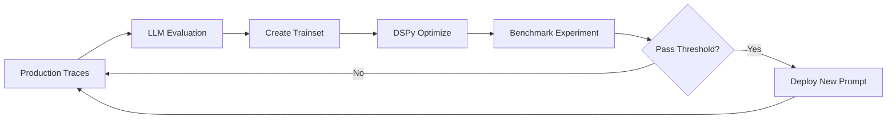

# TODO 로드맵 v2.0

> **작성일:** 2025-12-25
> **이전 버전:** [TODO_v1.md](./TODO_v1.md) (Phase 1-4 완료 기록 보존)

---

## 📋 목차

1. [현재 상태 요약](#1-현재-상태-요약-mvp-v10-완료)
2. [기술 결정 사항](#2-기술-결정-사항-technology-decisions)
3. [로드맵 개요](#3-로드맵-개요-phase-5-9-타임라인)
4. [Phase별 상세 계획](#4-phase별-상세-계획)
   - [Phase 5: 크롤러 확장 & 입력 검증](#phase-5-크롤러-확장--입력-검증)
   - [Phase 6: LLMOps & Evaluation](#phase-6-llmops--evaluation-phoenix)
   - [Phase 7: 품질 개선 전략](#phase-7-품질-개선-전략)
   - [Phase 8: Cloud 인프라 & CI/CD](#phase-8-cloud-인프라--cicd)
   - [Phase 9: 문서화 & 공유](#phase-9-문서화--공유)
5. [UI/UX 개선 백로그](#5-uiux-개선-백로그)
6. [참고 자료](#6-참고-자료)

---

## 1. 현재 상태 요약 (MVP v1.0 완료)

### ✅ 핵심 기능 달성률: 100%

| 목표            | 상태    | 구현 내용                                                    |
| --------------- | ------- | ------------------------------------------------------------ |
| ①기사 원문 정보 | ✅ 완료 | `SourcePanel` - 크롤링 + 메타데이터 + 원문 미리보기          |
| ②핵심 요약      | ✅ 완료 | `InsightCard` - 3줄 요약 + AI Thinking 스트리밍              |
| ③오디오 리포팅  | ✅ 완료 | `AudioPlayerCard` - 스크립트 생성 + TTS 합성 + 재생/다운로드 |

### ✅ 완료된 Phase

| Phase   | 내용                                     | 완료일     |
| ------- | ---------------------------------------- | ---------- |
| Phase 1 | 프론트엔드 UI 껍데기 + 백엔드 셋업       | 2025-12-16 |
| Phase 2 | 크롤링 & ETL 아키텍처 (GeekNews, Medium) | 2025-12-21 |
| Phase 3 | AI 서비스 구현 (요약 + 스크립트 + TTS)   | 2025-12-25 |
| Phase 4 | 프론트엔드 연동 (useState + fetch 유지)  | 2025-12-25 |
| Phase 5 | 크롤러 확장 & 입력 검증 (GenericCrawler) | 2025-12-25 |

### 지원 플랫폼 현황

| 플랫폼        | 상태    | 특징                                             |
| ------------- | ------- | ------------------------------------------------ |
| GeekNews      | ✅ 완료 | 전용 크롤러, 토픽 + 원본 외부 링크 (trafilatura) |
| Medium        | ✅ 완료 | 전용 크롤러, Freedium 미러 활용                  |
| 일반 웹사이트 | ✅ 완료 | GenericCrawler (trafilatura 기반) - Phase 5      |

**GenericCrawler 테스트 결과:**

- ✅ Naver News, a16z, Anthropic, TuringPost
- ⚠️ 조선일보/한겨레 (봇 차단)
- ❌ YouTube, Twitter 등 멀티미디어 플랫폼 (의도적 제외)

> 상세 구현 이력은 [DONE.md](./DONE.md) 및 [TODO_v1.md](./TODO_v1.md) 참조

---

## 2. 기술 결정 사항 (Technology Decisions)

| 결정 사항       | 선택                        | 근거                                                  |
| --------------- | --------------------------- | ----------------------------------------------------- |
| **LLMOps 도구** | Arize Phoenix               | DSPy 기반, 로컬/클라우드 유연성, 오픈소스             |
| **상태 관리**   | useState + fetch 유지       | 현재 기능에 충분, TanStack Query 불필요한 복잡도 회피 |
| **LLM 모델**    | Gemini 2.5 Flash + Thinking | Vertex AI 인증, Thinking 기능 지원, 비용 효율적       |
| **TTS 모델**    | OpenAI gpt-4o-mini-tts      | 품질/비용 균형, 한국어 자연스러움                     |
| **범용 크롤러** | trafilatura + BS4 fallback  | Phase 5에서 구현, GenericCrawler 클래스               |
| **URL 검증**    | Pydantic HttpUrl            | 내장 타입, 별도 라이브러리 불필요                     |
| **스트리밍**    | SSE (Server-Sent Events)    | thinking + content 분리, 실시간 UX                    |
| **클라우드**    | GCP (Cloud Run + Storage)   | Vertex AI와 통합, 비용 효율적                         |

### 기각된 기술

| 기술           | 기각 사유                                            |
| -------------- | ---------------------------------------------------- |
| TanStack Query | 현재 useState + fetch로 충분, 불필요한 추상화 레이어 |
| Langfuse       | Phoenix가 DSPy 통합 및 로컬 개발에 더 적합           |
| W&B Weave      | 클라우드 종속성, Phoenix로 통일하여 복잡도 감소      |

---

## 3. 로드맵 개요 (Phase 5-9 타임라인)

```
Phase 5 ─── Phase 6 ─── Phase 7 ─── Phase 8 ─── Phase 9
크롤러      LLMOps      품질개선     인프라      문서화
확장        평가        전략        배포        공유

✅ Done    🟡 Medium   🟡 Medium   🟢 Low     🟢 Low
           Priority    Priority    Priority   Priority
```

| Phase   | 핵심 목표                            | 우선순위  |
| ------- | ------------------------------------ | --------- |
| Phase 5 | 범용 크롤러 + 입력 검증              | ✅ 완료   |
| Phase 6 | Phoenix 통합 + Evaluation Pipeline   | 🟡 Medium |
| Phase 7 | Long context 대응 + Agentic workflow | 🟡 Medium |
| Phase 8 | GCP 배포 + CI/CD Pipeline            | 🟢 Low    |
| Phase 9 | 블로그 작성 + 포트폴리오화           | 🟢 Low    |

---

## 4. Phase별 상세 계획

### Phase 5: 크롤러 확장 & 입력 검증 ✅

> **목표:** 일반 웹사이트 지원 확대 및 사용자 입력 검증 강화
> **우선순위:** 🔴 High
> **완료일:** 2025-12-25

#### 사전 검토 사항

- [x] 지원할 플랫폼 목록 우선순위 결정 (Naver News, Substack, TuringPost 등)
- [x] trafilatura의 한국 사이트 호환성 테스트
- [x] URL 검증 라이브러리 선택 → Pydantic HttpUrl
- [x] 에러 메시지 UX 문구 정의

#### 구현 항목

##### 5-1. 범용 크롤러 개발 ✅

- [x] `backend/app/services/crawlers/generic.py` 생성
  - trafilatura 기반 범용 콘텐츠 추출
  - 메타데이터 추출 (title, author, date, image)
  - HTML 정제 및 본문 추출 로직 (BeautifulSoup fallback)
- [x] `CrawlerFactory`에 generic 크롤러 등록
  - URL 패턴으로 플랫폼 감지 실패 시 fallback으로 사용
  - `detect_platform()` 메서드 추가
- [x] 지원 플랫폼 확장 (테스트 완료)
  - [x] Naver News ✅
  - [x] a16z, Anthropic, TuringPost ✅
  - [x] 조선일보/한겨레 ⚠️ (봇 차단으로 인해 일부 실패)

##### 5-2. 입력 검증 강화 ✅

- [x] **Backend: URL 유효성 검사**
  - `CrawlRequest`에 URL validation (Pydantic HttpUrl)
  - 잘못된 URL 형식 시 400 Bad Request + 명확한 에러 메시지
  - 지원하지 않는 URL 시 안내 메시지 포함
- [x] **Frontend: 실시간 검증 피드백**
  - URL 입력 시 인라인 에러 표시 (디바운스 300ms)
  - 플랫폼 자동 감지 표시 (예: "GeekNews로 감지됨")
  - 지원 플랫폼 툴팁/안내 추가

##### 5-3. 에러 핸들링 시스템 ✅

- [x] 커스텀 에러 타입 정의 (`backend/app/services/crawlers/errors.py`)
  - `INVALID_URL_FORMAT`, `EMPTY_INPUT`, `UNSUPPORTED_CONTENT`, `NO_CONTENT`, `TIMEOUT` 등
- [x] 에러 코드별 사용자 친화적 메시지 (한국어)
- [x] HTTP 상태 코드 세분화 (400, 415, 422, 502, 504)

##### 5-4. Frontend 입력 검증 UI ✅

- [x] `checkUrlSupport()` API 함수 추가 (`frontend/lib/api.ts`)
- [x] 실시간 URL 검증 UI (`welcome-input.tsx`)
  - 유효: 녹색 테두리 + 체크 아이콘 + 플랫폼 표시
  - 무효: 빨간 테두리 + 에러 메시지
  - 검증 중: 로딩 스피너

#### 테스트 결과

| 플랫폼     | 결과        | 콘텐츠 길이           |
| ---------- | ----------- | --------------------- |
| GeekNews   | ✅ 성공     | 7,345자               |
| Naver News | ✅ 성공     | 394자                 |
| a16z       | ✅ 성공     | 14,761자              |
| Anthropic  | ✅ 성공     | 18,948자              |
| TuringPost | ✅ 성공     | 18,911자              |
| 조선일보   | ⚠️ 차단     | -                     |
| 한겨레     | ⚠️ 차단     | -                     |
| YouTube    | ✅ 에러처리 | `UNSUPPORTED_CONTENT` |

#### 완료 조건 (Definition of Done) ✅

1. ✅ 일반 블로그/뉴스 URL 입력 시 크롤링 성공
2. ✅ 잘못된 URL 입력 시 명확한 에러 메시지 표시
3. ✅ 플랫폼 자동 감지 결과가 Frontend에 표시됨

---

### Phase 6: LLMOps & Evaluation (Phoenix)

> **목표:** LLM 호출 추적, 비용 모니터링, 품질 평가 시스템 구축
> **우선순위:** 🟡 Medium
> **도구:** [Arize Phoenix](https://github.com/Arize-ai/phoenix)

#### 사전 검토 사항

- [x] Phoenix 로컬 설치 vs 클라우드 호스팅 결정 → **Docker 로컬 설치**
- [ ] 평가 데이터셋 구축 방안 (기존 크롤링 데이터 활용)
- [ ] SOTA LLM Benchmark 모델 선정 (GPT-4o, Claude Opus 등)
- [ ] 정량 평가 지표 정의 (RAGAS 활용 범위)

#### 구현 항목

##### 6-1. Phoenix 통합 ✅

- [x] `arize-phoenix` 의존성 추가 (`pyproject.toml`)
- [x] Phoenix 서버 설정 (`docker-compose.yml`)
- [x] LangChain 콜백 핸들러 연동 (`backend/app/core/tracing.py`)

  ```python
  from phoenix.otel import register
  from openinference.instrumentation.langchain import LangChainInstrumentor

  tracer_provider = register(
      project_name=settings.PHOENIX_PROJECT_NAME,
      endpoint=settings.PHOENIX_COLLECTOR_ENDPOINT,
  )
  LangChainInstrumentor().instrument(tracer_provider=tracer_provider)
  ```

- [x] 환경변수 설정 (`PHOENIX_COLLECTOR_ENDPOINT`, `PHOENIX_PROJECT_NAME`, `PHOENIX_ENABLED`)

##### 6-2. 모니터링 항목 구현 ✅

> Phoenix UI에서 자동 제공되는 기능들

- [x] **입력/출력 추적:** 프롬프트 및 LLM 응답 기록 (Traces 탭)
- [x] **LLM Chain Trace:** 호출 체인 시각화 (Span 상세 보기)
- [x] **비용 추적:** 토큰 사용량 및 API 비용 계산 (Token Usage)
- [x] **지연 시간:** 응답 시간 모니터링 (Latency)

##### 6-3. LLM Evaluation Pipeline

- [ ] **평가 대상 정의**
  - 생성된 요약 (bullet_points)
  - 뉴스 스크립트 (paragraphs)
- [ ] **Hard Case 테스트 세트 구축**
  - Long context (5,000자 이상 문서)
  - Multi-agenda 복합 문서
- [ ] **정량 평가 구현**
  - RAGAS 라이브러리 연동
  - LLM-as-a-Judge (SOTA LLM이 5점 척도 평가)
- [ ] **정성 평가 프레임워크**
  - Tone 평가 (뉴스 앵커 톤 자연스러움)
  - Factuality 평가 (사실 정확성)

##### 6-5. Self-Improving Loop (DSPy 연동)

> **목표:** Phoenix + DSPy를 활용한 자동 프롬프트 최적화 루프 구축
>
> **참고 자료:**
>
> - ['스스로 개선하는' 에이전트 만들어보기 (Turing Post Korea)](https://turingpost.co.kr/p/self-improving-agent-arize)
> - [DSPy 3 + GEPA: The Most Advanced RAG Framework Yet — Auto Reasoning & Prompting](https://medium.com/towards-artificial-intelligence/dspy-3-gepa-the-most-advanced-rag-framework-yet-auto-reasoning-prompting-f9124ebd975b)

- [ ] **1. Tracing 데이터 수집**
  - Phoenix에서 LLM 호출 기록 추출
  - 성공/실패 케이스 분류
- [ ] **2. 자동 레이블링**
  - LLM Evaluator로 응답 품질 자동 평가
  - 품질 점수 기반 필터링
- [ ] **3. 학습 데이터셋 구축**
  - 성공적인 예제를 DSPy 학습셋으로 변환
  - Few-shot 예제 자동 생성
- [ ] **4. 프롬프트 최적화**
  - DSPy MIPRO/GEPA 기법으로 프롬프트 자동 개선
  - A/B 테스트 파이프라인
- [ ] **5. 프롬프트 버전 관리**
  - Phoenix에서 최적화된 프롬프트 버전 관리
  - 롤백 메커니즘
- [ ] **6. 자동화 루프**
  - 주기적으로 1-5단계 반복 실행
  - 성능 임계치 기반 자동 배포



##### 6-4. 대시보드 ✅

> Phoenix UI (`http://localhost:6006`)에서 기본 제공

- [x] Phoenix UI에서 시각화 구성
  - 일별/주별 API 호출 수 (Traces 탭)
  - 평균 응답 시간 (Latency 메트릭)
  - 토큰 사용량 및 비용 (Token Usage)
  - 에러율 (Status 필터)

#### 예상 리스크/고려사항

| 리스크                       | 대응 방안                                        |
| ---------------------------- | ------------------------------------------------ |
| Phoenix 설치/설정 복잡성     | Docker Compose로 원클릭 설치 스크립트 준비       |
| 평가 데이터셋 부족           | 기존 크롤링 데이터 + 수동 curated 샘플 혼합      |
| LLM-as-Judge 비용            | 평가 주기 조절 (매번 X, 주기적 batch 평가)       |
| DSPy 학습 곡선               | 공식 문서 + 참고 자료 학습, 단순 케이스부터 시작 |
| 자동 최적화 품질 저하 리스크 | 임계치 기반 게이트, 수동 검토 단계 포함          |

#### 완료 조건 (Definition of Done)

1. ✅ Phoenix 대시보드에서 LLM 호출 trace 확인 가능
2. ✅ 토큰 사용량 및 비용 추적 동작 (Phoenix UI 기본 제공)
3. 최소 10개 샘플에 대한 Evaluation 점수 산출
4. DSPy 기반 프롬프트 최적화 1회 이상 실행 및 결과 비교

---

### Phase 7: 품질 개선 전략

> **목표:** Long context 대응력 및 요약/스크립트 품질 향상
> **우선순위:** 🟡 Medium

#### 사전 검토 사항

- [ ] Long context 임계치 정의 (몇 자 이상부터 chunking?)
- [ ] Agentic workflow 아키텍처 결정 (LangGraph vs 직접 구현)
- [ ] TTS 대안 모델 후보 선정 (ElevenLabs, Coqui 등)
- [ ] 품질 개선 우선순위 결정 (요약 vs 스크립트 vs TTS)

#### 구현 항목

##### 7-1. Long Context 대응

- [ ] **Chunk + Parallel Summarization**
  - 긴 문서를 청크로 분할
  - 각 청크 병렬 요약 후 merge
  - MoA (Mixture of Agents) 아키텍처 참고
- [ ] **Sliding Window 방식 검토**
  - 중복 컨텍스트를 유지하며 순차 요약

##### 7-2. Agentic Workflow

- [ ] **요약 품질 개선 파이프라인**
  ```
  Summarize Agent → Reviewer Agent → Final Writer
  ```
  - Summarize Agent: 초기 요약 생성
  - Reviewer Agent: 누락/오류 체크
  - Final Writer: 최종 정제
- [ ] **LangGraph 활용 검토**
  - 상태 기반 워크플로우 관리
  - 조건부 분기 (품질 점수 기반)

##### 7-3. 오디오 품질 개선

- [ ] **TTS 모델 비교 평가**
  - OpenAI gpt-4o-mini-tts (현재)
  - ElevenLabs
  - Google Cloud TTS
- [ ] **News Script 톤 개선**
  - 프롬프트 개선 (더 자연스러운 뉴스 앵커 톤)
  - 문장 호흡 최적화 (TTS 렌더링 고려)

#### 예상 리스크/고려사항

| 리스크                  | 대응 방안                                  |
| ----------------------- | ------------------------------------------ |
| Agentic workflow 복잡도 | 단순 버전 먼저 구현 후 점진적 개선         |
| LLM 비용 증가           | 품질 개선 효과 대비 비용 트레이드오프 분석 |
| Chunking 경계 정보 손실 | 오버랩 구간 설정, 청크 간 컨텍스트 전달    |

#### 참고 자료

- [MoA Architecture](https://medium.com/@amitXD/%EF%B8%8F-how-i-built-my-first-ai-agent-and-it-didnt-burn-my-laptop-9378196694ec)
- [News TL;DR LangGraph](https://github.com/NirDiamant/GenAI_Agents/blob/main/all_agents_tutorials/news_tldr_langgraph.ipynb)
- [Podcast Agent LangGraph](https://github.com/NirDiamant/GenAI_Agents/blob/main/all_agents_tutorials/generate_podcast_agent_langgraph.ipynb)
- [Anthropic Context Engineering](https://www.anthropic.com/engineering/effective-context-engineering-for-ai-agents)

#### 완료 조건 (Definition of Done)

1. 5,000자 이상 문서에서 요약 품질 유지
2. Evaluation 점수 기준선 대비 10% 이상 개선
3. TTS 품질 비교 리포트 작성

---

### Phase 8: Cloud 인프라 & CI/CD

> **목표:** 프로덕션 배포 환경 구축 및 자동화
> **우선순위:** 🟢 Low

#### 사전 검토 사항

- [x] GCP 프로젝트 및 결제 계정 설정 확인
- [x] 도메인 및 SSL 인증서 준비 (Vercel/Cloud Run 자동 제공)
- [ ] 환경별 설정 분리 방안 (dev/staging/prod) → CI/CD에서 처리 예정
- [ ] 비용 예산 설정 및 알림 구성

#### 구현 항목

##### 8-1. GCP Storage 마이그레이션 ✅

- [x] `data/` 하위 모든 저장소 → GCP Cloud Storage 이전
  - `users/{user_id}/crawled/` - `crawl.py`의 `save_crawl_result()` 수정
  - `users/{user_id}/summary/` - `summarize.py`의 `_save_summary_result()` 수정
  - `users/{user_id}/audio/` - `audio.py`의 `_save_script_result()`, `synthesize_speech()` 수정
- [x] Storage 접근 추상화 레이어 구현 (`backend/app/services/storage.py`)
  - `StorageService` Protocol 정의
  - `LocalStorageService`: 로컬 파일시스템 (기본값)
  - `GCSStorageService`: Google Cloud Storage
  - `STORAGE_BACKEND` 환경변수로 전환 (`local` | `gcs`)
- [x] 오디오 파일 Signed URL 서빙
  - GCS 사용 시 `GET /api/v1/audio/{article_id}.mp3` → Signed URL 302 리다이렉트
  - `GCS_SIGNED_URL_EXPIRY_MINUTES` 환경변수로 만료 시간 설정 (기본값: 60분)

##### 8-2. 서비스 아키텍처 배포 ✅

```
┌─────────────────────────────────────────────────────────────────┐
│                     Production Architecture                      │
│                                                                 │
│  ┌─────────────┐     ┌─────────────┐     ┌─────────────┐       │
│  │   Vercel    │     │  Cloud Run  │     │   Phoenix   │       │
│  │  Frontend   │────▶│   Backend   │────▶│   LLMOps    │       │
│  └─────────────┘     └──────┬──────┘     └─────────────┘       │
│                             │                                   │
│                             ▼                                   │
│                     ┌─────────────┐                             │
│                     │ GCP Storage │                             │
│                     │   (data)    │                             │
│                     └─────────────┘                             │
└─────────────────────────────────────────────────────────────────┘
```

**🚀 배포 완료 URL (2025-12-26):**

| 서비스                  | URL                                                              |
| ----------------------- | ---------------------------------------------------------------- |
| **Frontend (Vercel)**   | https://read-for-me-ten.vercel.app                               |
| **Backend (Cloud Run)** | https://read-for-me-backend-383521011372.asia-northeast3.run.app |
| **Phoenix (Cloud Run)** | https://phoenix-383521011372.asia-northeast3.run.app             |

- [x] **Backend (GCP Cloud Run)** - ✅ 배포 완료
  - `backend/Dockerfile` 작성 (multi-stage build, playwright 포함)
  - `backend/.dockerignore` 작성
  - `backend/env.example` 환경변수 템플릿
  - `docker-compose.yml` 로컬 테스트 환경 구성
  - Cloud Run 배포 가이드 (`docs/DEPLOY.md`)
  - Secret Manager 연동 (`OPENAI_API_KEY`)
  - GCS Storage 연결 (`STORAGE_BACKEND=gcs`)
- [x] **Frontend (Vercel)** - ✅ 배포 완료
  - Vercel CLI 배포 (`vercel --prod`)
  - 환경변수 설정 (`NEXT_PUBLIC_API_URL`)
  - Production 도메인 설정
- [x] **Phoenix (Cloud Run)** - ✅ 배포 완료
  - Cloud Run 서비스로 배포
  - Backend와 연동 (`PHOENIX_COLLECTOR_ENDPOINT`)
  - `min-instances=0` 비용 최적화

> **상세 배포 가이드:** [DEPLOY.md](./DEPLOY.md)

##### 8-3. CI/CD Pipeline

- [ ] **브랜치 전략**
  - `main`: 프로덕션 배포
  - `dev`: 개발 통합
  - Feature branch → PR → dev → main
- [ ] **GitHub Actions 워크플로우**
  - PR 시: Lint + Type check + Test
  - main push 시: 자동 배포
  - [x] **Apidog 자동 동기화** (2025-12-26): `backend/**` 변경 시 OpenAPI 스펙 동기화
- [ ] **환경별 배포**
  - dev 브랜치 → Staging 환경
  - main 브랜치 → Production 환경

#### 예상 리스크/고려사항

| 리스크                      | 대응 방안                                 |
| --------------------------- | ----------------------------------------- |
| Cold start 지연 (Cloud Run) | 최소 인스턴스 1 유지 또는 워밍업 설정     |
| 비용 급증                   | 예산 알림 설정, 사용량 모니터링           |
| 환경별 설정 혼선            | dotenv 파일 분리 + 환경변수 검증 스크립트 |

#### 완료 조건 (Definition of Done)

1. 프로덕션 URL에서 서비스 정상 동작
2. GitHub push 시 자동 배포 동작
3. GCP Storage에서 오디오 파일 서빙 확인

---

### Phase 9: 문서화 & 공유

> **목표:** 프로젝트 문서화, 블로그 작성, 포트폴리오화
> **우선순위:** 🟢 Low

#### 사전 검토 사항

- [ ] 블로그 플랫폼 선택 (velog, Medium, 개인 블로그)
- [ ] 데모 영상 길이 및 포맷 결정
- [ ] 타겟 독자층 정의 (개발자, 채용담당자, 일반 사용자)

#### 구현 항목

##### 9-1. 블로그 글 작성

- [ ] **서비스 소개**
  - Read-For-Me란? 핵심 가치 및 기능
  - 스크린샷 및 데모 GIF
- [ ] **기술 구조도**
  - 아키텍처 다이어그램
  - 기술 스택 설명 (Gemini, OpenAI TTS, SSE 등)
- [ ] **개발기 (바이브코딩 활용)**
  - Cursor + Claude를 활용한 개발 경험
  - AI 페어 프로그래밍 팁
- [ ] **트러블슈팅**
  - 주요 이슈 및 해결 과정
  - 성능 최적화 경험
- [ ] **Lessons Learned**
  - 기술 선택 회고
  - 개선점 및 향후 계획

##### 9-2. 영문 버전

- [ ] 주요 블로그 글 영문 번역
- [ ] README.md 영문 버전 추가

##### 9-3. 포트폴리오화

- [ ] **프로젝트 문서 정리**
  - README.md 업데이트 (Quick Start, 스크린샷)
  - CONTRIBUTING.md 작성 (선택)
- [ ] **데모 영상 제작**
  - 1-2분 분량 서비스 데모
  - 화면 녹화 + 나레이션
- [ ] **GitHub 프로젝트 정리**
  - 이슈/PR 정리
  - 라이선스 추가

#### 완료 조건 (Definition of Done)

1. 최소 1개 블로그 글 발행
2. 데모 영상 YouTube/Vimeo 업로드
3. GitHub README에 스크린샷 및 Quick Start 포함

---

## 5. UI/UX 개선 백로그

> DESIGN-SPEC.md의 향후 계획을 우선순위별로 정리

### 🔴 High Priority

| 항목                 | 설명                                      | 관련 Phase |
| -------------------- | ----------------------------------------- | ---------- |
| **Speed Control**    | 1.0x / 1.25x / 1.5x / 2.0x 재생 속도 토글 | Phase 7    |
| **URL 검증 피드백**  | 유효하지 않은 URL 입력 시 인라인 에러     | Phase 5    |
| **플랫폼 자동 감지** | URL 입력 시 지원 플랫폼 표시              | Phase 5    |

### 🟡 Medium Priority

| 항목                   | 설명                    | 관련 Phase |
| ---------------------- | ----------------------- | ---------- |
| **Rewind/Forward 10s** | -10s / +10s 버튼        | Phase 7    |
| **키보드 네비게이션**  | Tab 키로 주요 요소 접근 | Phase 9    |
| **Screen Reader**      | ARIA 레이블 추가        | Phase 9    |

### 🟢 Low Priority

| 항목                   | 설명                              | 관련 Phase |
| ---------------------- | --------------------------------- | ---------- |
| **Waveform 시각화**    | 오디오 파형 표시                  | Phase 7    |
| **미니 플레이어**      | 스크롤 시 하단 고정 미니 플레이어 | Phase 7    |
| **최근 입력 히스토리** | 이전에 처리한 URL 목록            | Phase 9    |
| **고대비 모드**        | 시각 장애인을 위한 고대비 테마    | Phase 9    |
| **다국어 지원**        | 한국어 / English 전환             | Phase 9    |
| **공유 기능**          | 생성된 콘텐츠 링크 공유           | Phase 9    |

---

## 6. 참고 자료

### 관련 문서

| 문서                               | 설명                            |
| ---------------------------------- | ------------------------------- |
| [PRD.md](./PRD.md)                 | 프로젝트 요구사항 정의서        |
| [DESIGN-SPEC.md](./DESIGN-SPEC.md) | UI/UX 상세 설계서               |
| [DONE.md](./DONE.md)               | 개발 완료 이력 인덱스           |
| [TODO_v1.md](./TODO_v1.md)         | 이전 TODO (Phase 1-4 상세 기록) |

### 실행 환경

```bash
# Frontend (Port 3000)
cd frontend
pnpm dev

# Backend (Port 8000)
cd backend
uv run uvicorn app.main:app --reload
```

### 디렉토리 구조

```
backend/
├── data/users/{user_id}/
│   ├── crawled/          # 크롤링 결과 JSON
│   ├── summary/          # 요약 결과 JSON
│   └── audio/            # 스크립트 JSON + MP3
├── prompts/v1/           # 프롬프트 템플릿
├── output_schemas/       # Pydantic 스키마
└── app/
    ├── services/         # 비즈니스 로직
    │   ├── crawlers/     # 플랫폼별 크롤러
    │   ├── summary.py    # 요약 서비스
    │   └── audio.py      # 오디오 서비스
    └── api/v1/           # API 엔드포인트

frontend/
├── app/                  # Next.js App Router
├── components/           # React 컴포넌트
└── lib/                  # 유틸리티 (api.ts 등)
```

### 버전 히스토리

| 버전 | 날짜       | 주요 변경                                               |
| ---- | ---------- | ------------------------------------------------------- |
| v1.0 | 2025-12-23 | 초기 TODO 문서 작성                                     |
| v2.0 | 2025-12-25 | Phase 구조 통일, PRD/DESIGN 통합, 개편                  |
| v2.1 | 2025-12-25 | Phase 5 완료: GenericCrawler, 입력 검증, 에러 핸들링    |
| v2.2 | 2025-12-26 | Phase 8 시작: Apidog CI/CD 자동 동기화 워크플로우       |
| v2.3 | 2025-12-26 | Phase 6 시작: Phoenix Tracing 통합 완료                 |
| v2.4 | 2025-12-26 | Phase 8-1 완료: GCS Storage 마이그레이션 구현           |
| v2.5 | 2025-12-26 | Phase 8-2 완료: Dockerfile, 배포 가이드 작성            |
| v2.6 | 2025-12-26 | **🚀 프로덕션 배포 완료**: Cloud Run + Vercel + Phoenix |
